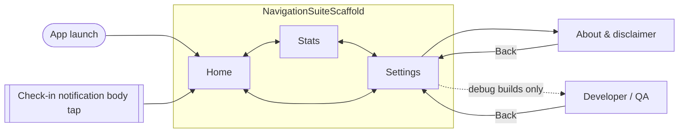

# US-01 — App shell, Home skeleton & theming

Story: `docs/product/user-stories.md#us-01` · Tokens: `design-system.md` · Status: Ready for Eng

This doc also defines the **target v1 Home anatomy** so later stories (US-03, 04, 06, 07, 10) slot into fixed positions without re-layout.

## 1. Navigation structure



- Top-level destinations (in `NavigationSuiteScaffold`, order fixed): **Home** (`ic_home`), **Stats** (`ic_stats`), **Settings** (`ic_settings`). Selected item uses the `_filled` icon variant.
  - Compact → bottom `NavigationBar`; Medium → `NavigationRail`; Expanded → `NavigationRail` (not drawer — only 3 items).
- Secondary screens (**About**, **Developer / QA**) are full-screen pushes *inside* the Settings tab: they show a `TopAppBar` with `ic_back` and keep the nav suite visible (selected = Settings).
- System back: from a secondary screen → Settings; from Stats/Settings → Home; from Home → exit.
- Tab state is preserved across switches (scroll position, selected Stats time frame) via `rememberSaveable`.
- Notification body tap deep-links to Home (clears secondary screens).

## 2. Screens in this story

### 2.1 Home (skeleton for US-01; target anatomy shown)

Compact (360×800dp reference). Scrollable `Column`, gutter 16dp, 12dp between cards.

```
┌────────────────────────────────────────┐
│ SuperUnclench                          │  TopAppBar (small, titleLarge, surface)
├────────────────────────────────────────┤
│ Hi there                               │  headlineMedium, onSurface         (16dp top)
│ Ready when you are.                    │  bodyLarge, onSurfaceVariant
│                                        │  24dp
│ ┌ [i] SuperUnclench is an awareness ──┐│  InfoBanner neutral  (slot A: banners)
│ │  tool, not medical advice. If you   ││
│ │  have jaw pain, talk to a dentist   ││
│ │  or doctor.                 [Got it]││
│ └─────────────────────────────────────┘│
│ ┌ Pending check-in card (US-03) ──────┐│  slot B (only when pending)
│ └─────────────────────────────────────┘│
│ ┌─────────────────────────────────────┐│  Level card (slot C)
│ │ LEVEL                   Warm-up     ││  labelMedium / titleMedium (right)
│ │ 1                                   ││  displayMedium
│ │ ▭▭▭▭▭▭▭ ▭▭▭▭▭▭▭ ▭▭▭▭▭▭▭             ││  SegmentedProgressBar (US-04)
│ │ 0 of 3 to Level 2                   ││  bodyMedium, onSurfaceVariant
│ │ (timer) Check-ins every 5 min       ││  bodyMedium (US-04)
│ └─────────────────────────────────────┘│
│ ┌─────────────────────────────────────┐│  Session card (slot D)
│ │ (● Stopped)                         ││  StatusChip
│ │ NEXT CHECK-IN                       ││  (US-06, hidden when stopped)
│ │ ┌─────────────────────────────────┐ ││
│ │ │          ▶  Start               │ ││  Button 56dp, full width
│ │ └─────────────────────────────────┘ ││
│ └─────────────────────────────────────┘│
│ TODAY                                  │  labelMedium, onSurfaceVariant (slot E, US-08 data)
│ ┌─────────┐ ┌─────────┐ ┌─────────┐    │  3 StatTiles, equal width, gap 8dp
│ │✓ GOOD   │ │✕ BAD    │ │◷ MISSED │    │
│ │ 0       │ │ 0       │ │ 0       │    │
│ └─────────┘ └─────────┘ └─────────┘    │
└────────────────────────────────────────┘
│  [Home]      [Stats]      [Settings]   │  NavigationBar
```

**Slot order is fixed:** A banners (0..n, priority order in §2.1.3) → B pending card → C level card → D session card → E today summary.

US-01 scope: title, greeting "Hi there", subtitle, disclaimer banner, Level card placeholder showing **"Level 1 · 0/3"**, session card with non-functional **Start**. Today tiles may be deferred to US-08 (show 0s if built now).

US-01 placeholder level card (before US-04 lands):
```
│ LEVEL                                  │
│ Level 1 · 0/3                          │  titleLarge
```
(Acceptance-criterion literal "Level 1 · 0/3" — US-04 replaces it with the full anatomy; keep the string in the card's contentDescription thereafter: "Level 1, 0 of 3".)

#### 2.1.1 Components
- `TopAppBar` (small) title "SuperUnclench", colors `surface` / scrolled `surfaceContainer` (`TopAppBarDefaults.enterAlwaysScrollBehavior` not needed — pinned).
- Greeting: `Text` headlineMedium; subtitle bodyLarge `onSurfaceVariant`.
- `InfoBanner(neutral)` for the disclaimer.
- `Card` (filled, `surfaceContainer`, shape `large`, padding 20dp) for Level and Session.
- `Button` (filled, `primary`) with `ic_play` 18dp + "Start", height 56dp, full width.

#### 2.1.2 Greeting subtitle copy (by state; finalised as later stories land)
| State | Subtitle |
|-------|----------|
| Stopped (default) | Ready when you are. |
| Running | Check-ins are on. Keep it loose. |
| Paused | Taking a break. |
| Quiet hours | Quiet hours — rest easy. |
| Pending check-in | Quick check: how's your jaw? |

Greeting: name set → `Hi, {name}`; else `Hi there`.

#### 2.1.3 Banner priority (slot A), top to bottom
1. Notifications off (US-03) 2. Auto-paused after misses (US-07 — shown in session card instead, see US-07) 3. Exact timing (US-05) 4. Disclaimer (US-01). Max **2** banners visible; lower-priority ones wait.

#### 2.1.4 States
| State | Presentation |
|-------|--------------|
| First launch | Disclaimer banner visible |
| After "Got it" | Banner collapses (`motion.medium`), persisted; never shown again until Reset all data |
| Loading persisted state | Do **not** show a spinner; render with defaults after DataStore's first emission (< 100ms). Use splash screen hold (`installSplashScreen().setKeepOnScreenCondition`) until first emission if needed to avoid a flash of wrong level. |
| Error | N/A (local only) |

### 2.2 Stats (placeholder in US-01)
TopAppBar "Stats". Centered empty state (see US-08 §empty): `ic_stats` 48dp `onSurfaceVariant`, titleMedium "No check-ins yet", bodyMedium "Tap Start on Home to begin." 

### 2.3 Settings (placeholder in US-01)
TopAppBar "Settings". List placeholder rows (disabled) — "Your name", "Theme", "About & disclaimer". In debug builds, the **Developer / QA** row is added in US-02.

## 3. Copy (exact)
| Key | Text |
|-----|------|
| app_name | SuperUnclench *(change from "Super Unclench" in strings.xml; single word matches spec)* |
| nav_home / nav_stats / nav_settings | Home / Stats / Settings |
| home_greeting_default | Hi there |
| home_greeting_named | Hi, %1$s |
| home_subtitle_stopped | Ready when you are. |
| disclaimer_body | SuperUnclench is an awareness tool, not medical advice. If you have jaw pain, talk to a dentist or doctor. |
| disclaimer_action | Got it |
| level_placeholder | Level 1 · 0/3 |
| action_start | Start |

## 4. Tokens
- Background `surface`; cards `surfaceContainer`, shape `large`, padding 20dp; gutter 16/24dp; card gap 12dp; section gap 24dp.
- Greeting `headlineMedium`; overline labels `labelMedium` uppercase `onSurfaceVariant`.
- Content max width 600dp centred on medium/expanded.

## 5. Theme implementation notes (Eng)
- Replace `Color.kt` template purples with the two schemes in design-system §2.2/2.3 (all roles, not just primary/secondary/tertiary).
- `SuperUnclenchTheme(themeMode: ThemeMode = SYSTEM)`; `dynamicColor` removed/false.
- Provide `LocalExtendedColors` (design-system §2.4).
- `Shapes(large = RoundedCornerShape(20.dp))`, rest default.
- `Typography` overrides per design-system §3.
- Status bar icon appearance follows resolved app theme.
- Add `values-night/themes.xml` for window background (no white flash).

## 6. Motion
- Tab switch: M3 default crossfade (`motion.short`); no slide.
- Disclaimer dismissal: `AnimatedVisibility(exit = shrinkVertically + fadeOut, motion.medium)`.

## 7. Accessibility
- TopAppBar title is a heading (`semantics { heading() }`); greeting also heading.
- Disclaimer banner: merged node "Note: SuperUnclench is an awareness tool…", button "Got it" separately focusable.
- Nav items have labels always shown (`alwaysShowLabel = true`).

## 8. Test tags
`nav_home`, `nav_stats`, `nav_settings`, `home_greeting`, `disclaimer_banner`, `disclaimer_got_it`, `level_card`, `btn_start`.

## 9. Open questions
- **Eng:** OK to hold the splash screen until DataStore's first emission (adds `core-splashscreen` dependency)? Alternative: skeleton-free default render.
- **PM:** confirm app name spelling "SuperUnclench" (strings.xml currently "Super Unclench").
- **PM:** dynamic color — Designer recommends **off** for v1 (see design-system §2.1). Confirm.
