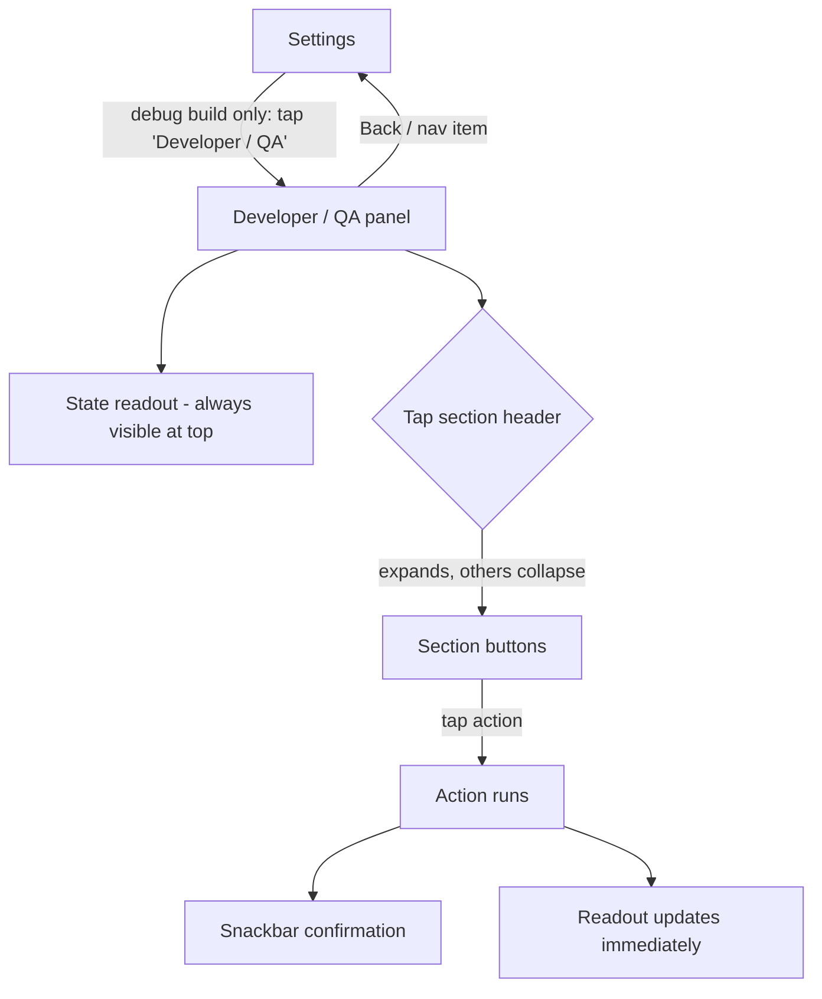

# US-02 — Developer / QA panel (debug builds only)

Story: `docs/product/user-stories.md#us-02` · Tokens: `design-system.md` · Status: Ready for Eng

**Principle:** QA can only **tap** and **screenshot**. Every flow in the app must be reachable and verifiable from this panel with taps alone; everything must fit on screen without swiping where possible — sections are **collapsible** (tap header) so any button is reachable in ≤ 2 taps without scrolling. (Scrolling is still supported for humans; QA scripts should use collapse/expand instead.)

This doc defines the **complete v1 panel** — each later story ships its own section (marked "Story").

## 1. Flow



## 2. Entry point (Settings)
Last group in Settings, only in debug:
```
│ DEVELOPER                                   │  titleSmall, primary
│ (bug) Developer / QA                   (>)  │  ListItem, 56dp; supporting "Debug build only"
```
Lives in `src/debug` (entry composable injected via a debug-only `DebugEntryProvider`; release provides a no-op).

## 3. Panel layout (compact)

```
┌──────────────────────────────────────────────┐
│ (<-)  Developer / QA                         │  TopAppBar (small)
├──────────────────────────────────────────────┤
│ ┌ STATE ───────────────────────────────────┐ │  Card, surfaceContainerHigh, pinned (not scrolled)
│ │ Session      Running                     │ │  2-col grid, bodySmall labels (onSurfaceVariant)
│ │ Level        3 · sub 2/4 (Aware)         │ │  values bodyMedium monospace (FontFamily.Monospace)
│ │ Interval     15 min  [short: 75 s]       │ │
│ │ Next alarm   14:32:05 (in 04:12)         │ │
│ │ Pending      yes (fired 14:17:05)        │ │
│ │ Misses       1 consecutive               │ │
│ │ Pause        —                           │ │
│ │ Short int.   ON                          │ │
│ │ Quiet hours  ON 22:00–07:00 · sim: OFF   │ │
│ │ Notif perm   granted   Exact: denied     │ │
│ │ Theme        System (dark)   Name: Alex  │ │
│ │ Disclaimer   dismissed   History: 214    │ │
│ └──────────────────────────────────────────┘ │
│ ▸ Profile & appearance                       │  Section header rows (ListItem 56dp,
│ ▾ Session & alarms                           │  titleSmall, trailing expand icon)
│   [ Fire alarm now          ] [ Mark missed ]│  2-col grid of FilledTonalButtons 48dp
│   [ Answer Good ] [ Answer Bad ]             │  Answer Good = good container colors,
│   [ Short intervals: OFF → ON ]              │  Answer Bad = bad container colors
│   [ End pause now ] [ Simulate reboot ]      │
│   [ Open notification shade ]                │
│ ▸ Level (SRS)                                │
│ ▸ History                                    │
│ ▸ Quiet hours                                │
│ ▸ Permissions & banners                      │
│ ▸ Danger zone                                │
└──────────────────────────────────────────────┘
```

- State card height ~300dp at 1.0 font scale; it is the **first item of the single `LazyColumn`** (changed 2026-09-30 — pinning made lower Danger-zone buttons unreachable; see qa/US-04/signoff-design.md). At fontScale ≥ 1.3 the state card becomes collapsible too (header "State" with summary line "Running · L3 2/4 · next 04:12").
- **Tap-only reachability (added 2026-09-30, fixes US-05 B1b):**
  1. **Jump chips** — a non-scrolling `FlowRow` of `AssistChip`s pinned directly under the TopAppBar (outside the `LazyColumn`, `surface` background, 8dp gaps, 48dp touch targets, wraps to 2 lines if needed): **State · Profile · Session · Level · History · Quiet · Perms · Danger** (only sections that exist). Tapping a chip opens that section (accordion rule) and calls `listState.animateScrollToItem(index)` so the section header lands at the top of the list; **State** scrolls to item 0. Test tags `qa_jump_<section>` (`qa_jump_state`, `qa_jump_danger`, …).
  2. **Expanding a section by its header also scrolls it to the top** (`animateScrollToItem` after expand), so its buttons are always visible without scrolling.
  3. **State card is compact by default:** fields as now, but "Last events" moves into its own collapsible sub-block (header "Last events (10)", collapsed by default; "Last 5" row stays visible). This keeps the card ≲ 360dp.
  4. Panel always opens at item 0 with all sections collapsed on a fresh entry (do not restore scroll offset across process death — the "opens already scrolled" behaviour in US-05 QA 04 is a bug).
- **Accordion:** only one section open at a time; opening one closes others. Default open: none. Open section persists via `rememberSaveable` (so a screenshot after an action keeps context).
- Buttons: `FilledTonalButton`, min height 48dp, 2 per row (`FlowRow`, 8dp gaps), label `labelLarge`, `maxLines = 2`. Toggle buttons show current value in label: "Short intervals: ON".
- After every action: `Snackbar` (short, 2s) with exact copy from §4; readout refreshes in the same frame.
- Next alarm "in mm:ss" in the readout ticks every second (tabular).

## 4. Complete action list & exact copy

| Section | Button label | Effect | Snackbar | Story |
|---------|--------------|--------|----------|-------|
| Profile & appearance | Set name: "Alex" | name = Alex | Name set to Alex | 02 |
| | Clear name | name = null | Name cleared | 02 |
| | Theme: System / Light / Dark *(label shows current; tap cycles System→Light→Dark→System)* | theme mode | Theme: Dark | 02 |
| | Show disclaimer again | disclaimerDismissed = false | Disclaimer will show on Home | 02 |
| Session & alarms | Fire alarm now | If running: post check-in now (replaces pending → prior counts Missed). If not running: nothing | Alarm fired / Not running | 03 |
| | Answer Good | answers current pending (or applies Good even with no pending, for SRS testing) | Answered Good · L2 1/3 | 04 |
| | Answer Bad | as above | Answered Bad · L2 0/3 | 04 |
| | Mark missed | treat pending as dismissed (deleteIntent path) | Marked missed (2 in a row) / No pending check-in | 07 |
| | Short intervals: OFF/ON | scale 1 min → 1 s (founder request, 2026-09-30) | Short intervals ON | 05 |
| | End pause now | fires the timed-pause end path immediately | Pause ended — running / Not paused | 06 |
| | Simulate reboot | re-runs BOOT_COMPLETED rescheduling path | Boot path ran · next 14:32:05 | 05 |
| | Open notification shade | `StatusBarManager.expandNotificationsPanel` via reflection / `cmd statusbar` equivalent | Opening shade | 02/03 |
| Level (SRS) | 1 · 2 · 3 · 4 · 5 · 6 · 7 · 8 *(8 square 48dp buttons in one row on ≥ 400dp; 2 rows of 4 otherwise)* | level = N, subLevel = 0 | Level set to 3 | 04 |
| | Sub-level +1 | sets subLevel = min(sub+1, count−1); no promotion, no history | Sub-level 2/4 | 04 |
| History | Seed sample history (30 days) | deterministic dataset (see US-08 §seed) | Seeded 30 days (N events) | 08 |
| | Clear history | history = [] | History cleared | 08 |
| Quiet hours | Simulate quiet hours now: OFF/ON | treat "now" as inside quiet hours | Quiet hours simulated ON | 10 |
| | Quiet hours switch: ON/OFF | same as Settings switch | Quiet hours OFF | 10 |
| | Preset: 22–07 / 23–08 / 21–06 | 3 buttons | Quiet hours 23:00–08:00 | 10 |
| Permissions & banners | Preview: notifications off: OFF/ON | forces "notification permission denied" state for UI | Preview notifications-off ON | 03/05 |
| | Preview: exact alarms denied: OFF/ON | forces `canScheduleExactAlarms() == false` for UI + scheduling path | Preview exact-denied ON | 05 |
| | Preview: Android 12 (no runtime notif permission): OFF/ON | forces the ≤ API 32 Start path (no rationale) | Preview API ≤ 32 ON | 03 |
| | Preview: rationale sheet | opens the notifications rationale sheet directly | — | 03 |
| Danger zone | Reset all data | L1/0, no history, stopped, name cleared, disclaimer shown, theme System, quiet hours default, previews off, short intervals off | All data reset | 02 |
| | Reset progress (no confirm) | L1/0, keep history | Progress reset | 09 |

Danger zone buttons use `OutlinedButton` with `error` content color (still 48dp) — no confirmation dialog in the debug panel (speed for QA).

## 5. States
| State | Behaviour |
|-------|-----------|
| Release build | Entry row absent; panel code not compiled in |
| Action not applicable (e.g. Mark missed with no pending) | Button stays enabled; snackbar explains ("No pending check-in") — never disable, so QA screenshots show deterministic feedback |
| Rapid taps | Snackbars replace each other (`currentSnackbarData?.dismiss()` before showing) |

## 6. Tokens
- Screen `surface`; state card `surfaceContainerHigh`, shape `large`, padding 16dp; monospace values `bodyMedium`.
- Section header `titleSmall` `primary`; buttons `FilledTonalButton` (`secondaryContainer`); Answer Good/Bad buttons use `goodContainer`/`badContainer` with on-colors.
- Gaps 8dp between buttons, 16dp gutter.

## 7. Motion
- Accordion expand/collapse `motion.medium`; with reduced motion instant.

## 8. Accessibility
Debug-only, but still: 48dp targets, labels are full sentences for TalkBack, readout card is a single merged node.

## 9. Test tags
Readout: `qa_state`, and one per field: `qa_state_session`, `qa_state_level`, `qa_state_next_alarm`, `qa_state_misses`, `qa_state_short`, `qa_state_quiet`.
Sections: `qa_section_profile`, `qa_section_session`, `qa_section_level`, `qa_section_history`, `qa_section_quiet`, `qa_section_perms`, `qa_section_danger`.
Buttons: `qa_set_name`, `qa_clear_name`, `qa_theme_cycle`, `qa_show_disclaimer`, `qa_fire_alarm`, `qa_answer_good`, `qa_answer_bad`, `qa_mark_missed`, `qa_short_intervals`, `qa_end_pause`, `qa_simulate_reboot`, `qa_open_shade`, `qa_level_1`…`qa_level_8`, `qa_sub_plus`, `qa_seed_history`, `qa_clear_history`, `qa_sim_quiet`, `qa_quiet_switch`, `qa_quiet_preset_22`, `qa_quiet_preset_23`, `qa_quiet_preset_21`, `qa_preview_notif_off`, `qa_preview_exact_denied`, `qa_preview_api32`, `qa_preview_rationale`, `qa_reset_all`, `qa_reset_progress`.

## 10. Open questions
- **Eng:** can `Open notification shade` work from the app (needs `EXPAND_STATUS_BAR` permission, debug manifest only)? If QA can use `adb shell cmd statusbar expand-notifications`, keep the button anyway as a convenience.
- **Eng:** "Answer Good/Bad" with no pending check-in — Designer proposes it still applies the SRS rule and records history (so SRS AC can be tested without firing alarms). PM to confirm.
- **PM:** Sub-level +1 is a QA convenience not in the story — OK to include?
