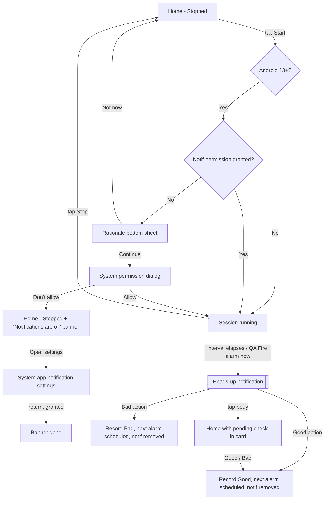

# US-03 — Start a session & receive a check-in notification

Story: `docs/product/user-stories.md#us-03` · Tokens: `design-system.md` · Status: Ready for Eng

## 1. Flow



Note: if the system has already permanently denied (user chose "Don't allow" twice), `shouldShowRequestPermissionRationale` is false and the dialog won't appear — then **Continue** in the sheet goes straight to app notification settings (sheet copy changes, see §3.1 state B).

## 2. Home changes

### 2.1 Session card — Stopped vs Running
```
Stopped                                   Running (US-03; countdown added in US-06)
┌─────────────────────────────────────┐   ┌─────────────────────────────────────┐
│ (● Stopped)                         │   │ (● Running)                         │
│                                     │   │ NEXT CHECK-IN  (US-06)              │
│ ┌─────────────────────────────────┐ │   │ ┌───────────────┐ ┌───────────────┐ │
│ │           ▶  Start              │ │   │ │ ❚❚  Pause     │ │ ■  Stop       │ │
│ └─────────────────────────────────┘ │   │ └───────────────┘ └───────────────┘ │
│ You'll get a quick check-in every   │   │                                     │
│ 5 min. Answer with one tap.         │   │                                     │
└─────────────────────────────────────┘   └─────────────────────────────────────┘
```
- Start: `Button` filled `primary`, 56dp, full width, `ic_play`.
- Stopped helper text: bodyMedium `onSurfaceVariant`, "You'll get a quick check-in every {interval}. Answer with one tap." (interval from current level).
- Running: two equal buttons, gap 12dp, 48dp: **Pause** `FilledTonalButton` (`ic_pause`) — non-functional until US-06 (hide it in US-03 if US-06 not yet built; Stop then spans full width); **Stop** `OutlinedButton` (`ic_stop`), default `primary` content, `outline` border — Stop is not destructive (level is kept).
- Stop has **no confirmation** (progress is kept; low-risk). Snackbar "Check-ins stopped. Your level is saved." with no action.
- Start success snackbar: none (the chip change + countdown are the feedback).

### 2.2 Pending check-in card (slot B)
Shown when a check-in notification is pending (and removed when answered from anywhere).
```
┌─────────────────────────────────────────┐  Card: primaryContainer, 1dp primary border,
│ (sentiment_calm)  CHECK-IN · 14:17      │  shape large, padding 20dp
│                                         │  labelMedium onPrimaryContainer
│ Were you clenching just now?            │  titleLarge onPrimaryContainer
│ Notice your jaw, then tap one.          │  bodyMedium onPrimaryContainer (80%)
│                                         │  16dp
│ ┌────────────────┐  ┌────────────────┐  │  AnswerButtons (56dp)
│ │ ✓  Good        │  │ ✕  Bad         │  │  good / bad fills
│ └────────────────┘  └────────────────┘  │
│   I was relaxed       I was clenching   │  bodySmall captions
└─────────────────────────────────────────┘
```
- The time is when the alarm fired (`HH:mm`, 24h/12h per system setting).
- On answer: the card shows a 1.2s confirmation in place (content cross-fades to a single row: `ic_good` + "Nice — noted." on `goodContainer`, or `ic_bad` + "Noted. Unclench and breathe out." on `badContainer`), then collapses (`motion.medium`). Next alarm scheduled immediately; the countdown in the session card updates.
- Screen reader: card announces politely when it appears: "Check-in: were you clenching just now?"

### 2.3 Notifications-off banner (slot A, priority 1)
`InfoBanner(attention)` with `ic_notifications_off`:
```
┌─────────────────────────────────────────┐
│ (bell-off) Notifications are off —      │  bodyMedium
│            check-ins can't reach you.   │
│                          [Open settings]│  TextButton
└─────────────────────────────────────────┘
```
Shown when permission is denied (API 33+) **or** channel "Check-ins" is blocked **or** app notifications disabled (`NotificationManagerCompat.areNotificationsEnabled() == false`), checked on every `ON_RESUME`. Not dismissible. Open settings → `Settings.ACTION_APP_NOTIFICATION_SETTINGS` (API 26+; fallback app details on 24–25).

## 3. Rationale bottom sheet
`ModalBottomSheet` (surfaceContainerLow, shape extraLarge top corners, drag handle shown). Dismissible by tapping scrim or **Not now** (QA can't swipe — button required).

```
┌─────────────────────────────────────────┐
│                ─────                    │  drag handle
│                                         │
│        (bell icon 48dp, primary)        │  in 72dp primaryContainer circle
│                                         │
│   Check-ins arrive as notifications     │  headlineSmall, centered
│                                         │
│   SuperUnclench sends a short check-in  │  bodyLarge, onSurfaceVariant, centered
│   now and then. Allow notifications so  │
│   they can reach you — no spam, and you │
│   can pause any time.                   │
│                                         │  24dp
│ ┌─────────────────────────────────────┐ │
│ │             Continue                │ │  Button 56dp full width
│ └─────────────────────────────────────┘ │
│              [ Not now ]                │  TextButton 48dp
└─────────────────────────────────────────┘  + navigation bar inset + 16dp
```
State B (permanently denied): body "Notifications are turned off for SuperUnclench. Turn them on in Settings so check-ins can reach you." · primary button "Open settings".

Icon: use `ic_notifications` (Material Symbol `notifications`) — add to drawable list.

## 4. Notification design

### 4.1 Channel
- ID `checkins`, name **"Check-ins"**, description "Short check-ins asking if your jaw is relaxed.", importance HIGH, sound default notification sound, vibration pattern `[0, 250, 150, 250]` (two soft pulses), lights off, lockscreen visibility PUBLIC (content is not sensitive).

### 4.2 Anatomy
| Property | Value |
|----------|-------|
| Small icon | `ic_stat_checkin` (Material Symbol *sentiment_calm*, white, 24dp) |
| Accent color (`setColor`) | `notif_accent` `#3D5F90` |
| Title | Check-in: jaw relaxed? |
| Text | Were you clenching just now? Tap Good or Bad. |
| Sub-text / header | **none** — removed 2026-09-30: on API 31+ it truncates the title in the collapsed header (see qa/US-03/signoff-design.md) |
| Category | `CATEGORY_REMINDER` |
| Priority (pre-26) | `PRIORITY_HIGH` |
| Content intent | Opens MainActivity → Home (pending card visible) |
| Delete intent | Marks Missed (US-07) |
| Auto-cancel | true; `setOnlyAlertOnce(false)` (each new alarm alerts) |
| `setTimeoutAfter` | none (miss detection is by next alarm) |
| Style | none (BigText not needed; copy fits) |
| Actions | **Good**, **Bad** (in that order) |
| Notification ID | constant (single pending alarm) — new alarm replaces |
| `setWhen` / `setShowWhen` | fire time, shown |
| Full-screen intent | **none** |

Heads-up (collapsed) mockup:
```
┌────────────────────────────────────────────────┐
│ (☺) SuperUnclench · now                         │
│ Check-in: jaw relaxed?                         │
│ Were you clenching just now? Tap Good or Bad.  │
│  GOOD                BAD                       │  <- action row
└────────────────────────────────────────────────┘
```

### 4.3 Making Good / Bad clearly green / red
Android draws notification actions as text buttons tinted by the system; developer colour is honoured only in limited cases (colorized notifications — foreground services/`CallStyle`/media — and, on some versions, `ForegroundColorSpan`s in action titles). Plan:

**Option A (default, ship first):** Standard actions with coloured, bold titles.
- Title = `SpannableString("Good")` with `ForegroundColorSpan(notif_good)` + `StyleSpan(BOLD)`; Bad likewise with `notif_bad`. Colours resolved from `values`/`values-night` against **system** night mode.
- Action icons: `ic_good` / `ic_bad` (not shown by modern templates, but used by Wear/Android Auto and pre-N).
- Labels are **words** so meaning never depends on colour: "Good" / "Bad". No emoji.
- Expected result: coloured on many API 24–30 builds and some OEM skins; on newer Pixel builds the system may normalise colour (it at least enforces contrast). Acceptable because labels carry meaning.

**Option B (if A shows uncoloured on API 31+ in Eng spike):** `DecoratedCustomViewStyle` with custom `RemoteViews` for collapsed, heads-up and expanded views, containing two coloured pill buttons (`good`/`bad` fills, `onGood`/`onBad` text, 40dp high, 20dp radius background drawable, check/close icons) wired with `setOnClickPendingIntent` to the same receiver. **No** standard actions in this option (avoid duplicates). Layout: title line (system-drawn by decorated style) + our row `[ ✓ Good ][ ✕ Bad ]` with 8dp gap. Must supply `values-night` drawables for dark shade.
- Trade-offs: more code, custom views limited to ~48dp collapsed height on some OEMs (heads-up view gets 88dp), must be tested on API 24/29/33/35/37.

**Fallback on any failure:** Option A without colour — still clear via word labels; the in-app pending card is always fully coloured.

Designer recommendation: build A; Eng timeboxes a 0.5-day spike of B and screenshots both on API 33 and 35 emulators; Designer picks.

### 4.4 After answering from the notification
- Notification removed immediately (`cancel(id)`); **no** follow-up confirmation notification (would be spam).
- If app is in foreground, Home updates live (pending card collapses, level feedback per US-04).

## 5. Copy (exact)
| Key | Text |
|-----|------|
| action_start | Start |
| action_pause | Pause |
| action_stop | Stop |
| session_running | Running |
| session_stopped | Stopped |
| session_stopped_helper | You'll get a quick check-in every %1$s. Answer with one tap. |
| snackbar_stopped | Check-ins stopped. Your level is saved. |
| rationale_title | Check-ins arrive as notifications |
| rationale_body | SuperUnclench sends a short check-in now and then. Allow notifications so they can reach you — no spam, and you can pause any time. |
| rationale_body_blocked | Notifications are turned off for SuperUnclench. Turn them on in Settings so check-ins can reach you. |
| rationale_continue | Continue |
| rationale_open_settings | Open settings |
| rationale_not_now | Not now |
| banner_notif_off | Notifications are off — check-ins can't reach you. |
| banner_open_settings | Open settings |
| pending_overline | CHECK-IN · %1$s |
| pending_title | Were you clenching just now? |
| pending_body | Notice your jaw, then tap one. |
| answer_good | Good |
| answer_bad | Bad |
| answer_good_caption | I was relaxed |
| answer_bad_caption | I was clenching |
| answered_good | Nice — noted. |
| answered_bad | Noted. Unclench and breathe out. |
| notif_channel_name | Check-ins |
| notif_channel_desc | Short check-ins asking if your jaw is relaxed. |
| notif_title | Check-in: jaw relaxed? |
| notif_text | Were you clenching just now? Tap Good or Bad. |
| notif_subtext | *(unused — sub-text removed, see §4.2)* |
| qa_not_running | Not running |

Interval formatting (`%s`): "5 min", "10 min", "15 min", "30 min", "45 min", "1 h", "2 h", "3 h".

## 6. Tokens
Pending card `primaryContainer` / `onPrimaryContainer`, border 1dp `primary`, shape `large`; answer buttons `good`/`bad`; banner `tertiaryContainer`; sheet `surfaceContainerLow`, shape `extraLarge`.

## 7. Motion
- Stopped↔Running: button row cross-fade `motion.short`; StatusChip colour animates `motion.short`.
- Pending card enter: `expandVertically + fadeIn` `motion.medium`; exit after 1.2s confirmation.
- Sheet: M3 default.

## 8. Accessibility
- Answer buttons contentDescription: "Good, I was relaxed" / "Bad, I was clenching".
- Pending card is announced (polite live region) and receives accessibility focus when the app is opened from the notification.
- Notification actions have text labels (screen readers read "Good", "Bad").
- Rationale sheet: title is heading; focus starts on title.

## 9. Test tags
`btn_start`, `btn_pause`, `btn_stop`, `status_chip`, `pending_card`, `btn_answer_good`, `btn_answer_bad`, `banner_notif_off`, `banner_notif_off_settings`, `sheet_rationale`, `sheet_continue`, `sheet_not_now`.

## 10. Open questions
- **Eng:** Option A vs B spike (see §4.3). Also confirm action PendingIntents hit a BroadcastReceiver with the app killed.
- **PM:** "Not now" on the rationale sheet — keep session stopped (Designer proposal) rather than starting without notifications.
- **PM:** Should Stop ever need confirmation? Designer: no — nothing is lost.
