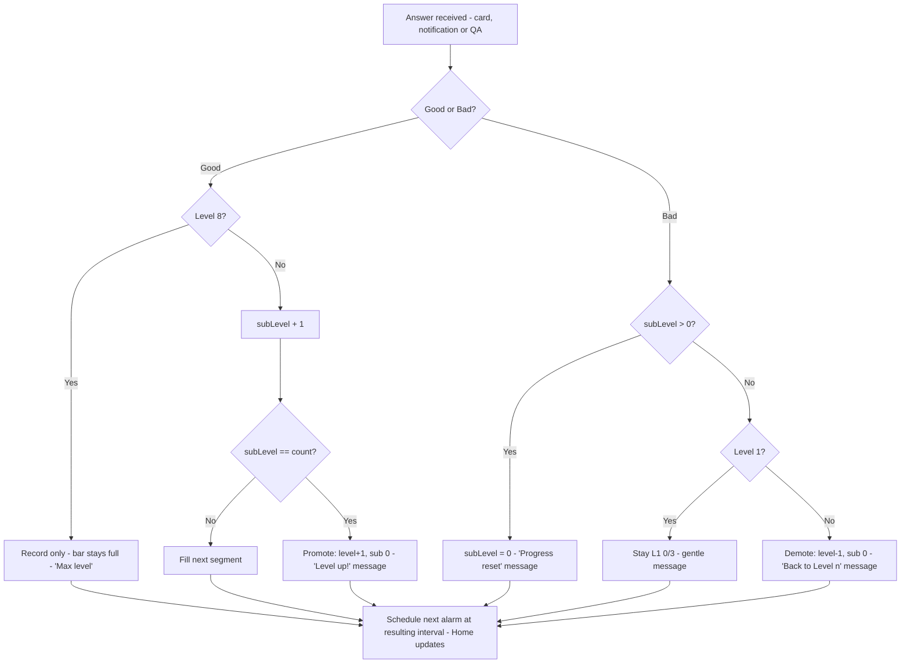

# US-04 — SRS progression: level counter & sub-level progress bar

Story: `docs/product/user-stories.md#us-04` · Tokens: `design-system.md` · Status: Ready for Eng

## 1. Flow



## 2. Level card (Home slot C) — full anatomy

```
┌─────────────────────────────────────────────┐  Card surfaceContainer, shape large, pad 20dp
│ LEVEL                          Aware        │  labelMedium onSurfaceVariant | titleMedium primary (level name)
│ 3                               of 8        │  displayMedium onSurface, tabular | bodyMedium onSurfaceVariant, baseline-aligned
│                                             │  12dp
│ ████████████ ████████████ ░░░░░░░░ ░░░░░░░░ │  SegmentedProgressBar: 4 segments, 12dp high, 6dp gaps
│                                             │  8dp
│ 2 of 4 to Level 4                           │  bodyMedium onSurfaceVariant (tabular)
│ ─────────────────────────────────────────── │  1dp outlineVariant, 16dp vertical margin
│ (timer) Check-ins every 15 min              │  bodyMedium onSurface; icon 18dp onSurfaceVariant
│ ┌ feedback message (transient) ──────────┐  │  see §3
│ └────────────────────────────────────────┘  │
└─────────────────────────────────────────────┘
```

- Level number: `displayMedium` (45sp, weight 500). On expanded width use `displayLarge`.
- Level names (from SRS table, used as the right-aligned title): 1 Warm-up · 2 Noticing · 3 Aware · 4 Steady · 5 Relaxed · 6 Grounded · 7 Loose · 8 Unclenched.
- "of 8" helper, right-aligned on same row as number — gives a sense of the journey.
- Progress caption: `"{sub} of {count} to Level {level+1}"`.
- **Level 8:** bar shows 5 segments all filled with `tertiary`; caption "Max level · Goods still count"; the level row reads `8` with name "Unclenched"; the card's accessibility label and the literal "Level 8 · Max level" appear as the caption's first line: **"Level 8 · Max level"** (AC text) followed by bodySmall "Goods still count".
- Interval line: `"Check-ins every {interval}"` from the resulting level. When Short intervals (debug) is ON, append " (short: {n} s)" in `bodySmall` `tertiary` — debug builds only.

### 2.1 SegmentedProgressBar spec
| Property | Value |
|----------|-------|
| Segments | = sub-level count of current level (3, 3, 4, 4, 4, 5, 5, 5) |
| Height | 12dp |
| Gap | 6dp |
| Shape | full (6dp radius) |
| Filled | `primary` |
| Empty | `outlineVariant` (was `surfaceContainerHighest`; see design-system §9.1) |
| Max level | all `tertiary` |
| Width | fills card content width; segments equal width |

## 3. Feedback messages (transient, inside the level card)
Rendered as a row at the bottom of the level card, shape `medium`, padding 12dp, icon 20dp + bodyMedium, visible **4 seconds** then collapses. Also announced via polite live region. Only the most recent message shows.

| Event | Container / content | Icon | Copy |
|-------|--------------------|------|------|
| Good, no promotion | — (no message; segment fill animation is the feedback) | — | — |
| Promotion | `tertiaryContainer` / `onTertiaryContainer` | `ic_level_up` | **Level up!** Check-ins now every {interval}. |
| Good at L8 | `goodContainer` / `onGoodContainer` | `ic_good` | Still unclenched. Nice. |
| Bad, sub > 0 (progress reset) | `secondaryContainer` / `onSecondaryContainer` | `ic_restart` | Progress for this level reset. You're still at Level {n}. |
| Bad, sub == 0, demote | `secondaryContainer` / `onSecondaryContainer` | `ic_level_down` | Back to Level {n} — check-ins every {interval}. You've got this. |
| Bad at L1 0/3 | `secondaryContainer` / `onSecondaryContainer` | `ic_info` | Noticing is the first step. Check-ins stay every 5 min. |

Never use red/`bad` for level-down; it's feedback, not punishment. "Level up!" is the only exclamation in the app. In the text, "Level up!" is `titleSmall` weight and the rest `bodyMedium`.

## 4. States
| State | Display |
|-------|---------|
| New user | Level 1, Warm-up, 3 empty segments, "0 of 3 to Level 2", "Check-ins every 5 min" |
| L1 1/3 | 1 filled |
| L2 0/3 after promotion | number animates 1→2, bar re-renders with 3 empty, Level up message |
| L3 0/4 after Bad from 2/4 | 2 filled segments drain (right→left) |
| L2 0/3 after Bad from L3 0/4 | number 3→2, 4 segments → 3 |
| L8 | see §2 |
| Answer while app not visible | On next open, **no** replayed animation/message (state just shows); message only for answers made while Home visible, or within the last 10 s before resume (so opening the app right after a notification answer still shows "Level up!") |

## 5. Copy (exact)
| Key | Text |
|-----|------|
| level_overline | LEVEL |
| level_of_total | of 8 |
| level_progress | %1$d of %2$d to Level %3$d |
| level_max | Level 8 · Max level |
| level_max_sub | Goods still count |
| interval_line | Check-ins every %1$s |
| level_names | Warm-up, Noticing, Aware, Steady, Relaxed, Grounded, Loose, Unclenched |
| msg_level_up | Level up! Check-ins now every %1$s. |
| msg_max_good | Still unclenched. Nice. |
| msg_reset | Progress for this level reset. You're still at Level %1$d. |
| msg_demote | Back to Level %1$d — check-ins every %2$s. You've got this. |
| msg_floor | Noticing is the first step. Check-ins stay every 5 min. |

## 6. Tokens
Card `surfaceContainer`; number `displayMedium` `onSurface`; level name `titleMedium` `primary`; bar `primary`/`surfaceContainerHighest`/`tertiary`; messages per §3.

## 7. Motion
- Segment fill: width 0→full, `motion.medium`.
- Segment drain on Bad: filled segments fade to empty right→left, 80ms stagger, `motion.medium`.
- Promotion: last segment fills (`motion.medium`) → whole bar pulses scale 1.0→1.04→1.0 (`motion.celebrate`) → level number slides up/out and new number in (`AnimatedContent`, `slideInVertically { it } + fadeIn`, `motion.long`) → bar cross-fades to new segment count.
- Demotion: number slides down (reverse direction), no pulse.
- Reduced motion: all instant; message still shows.
- Everything settles < 1s (QA screenshot rule) except the message, which stays 4s — QA screenshots the message within that window (screenshot immediately after tap).

## 8. Accessibility
- Level card merged node: "Level 3, Aware. 2 of 4 to Level 4. Check-ins every 15 minutes." (use "minutes"/"hours" spelled out in contentDescription).
- Progress bar `progressBarRangeInfo(2f, 0f..4f, steps = 3)`.
- Feedback messages: polite live region.
- At fontScale ≥ 1.5, "of 8" moves under the number; level name wraps below "LEVEL".

## 9. Test tags
`level_card`, `level_number`, `level_name`, `level_progress_bar`, `level_progress_caption`, `interval_line`, `level_message`.

## 10. Open questions
- **PM:** show a count of total Goods toward Level 8 ("12 of 28")? Designer: not in v1 — keep it simple.
- **Eng:** `AnimatedContent` for the number and segment-count cross-fade is standard; confirm no concerns.
