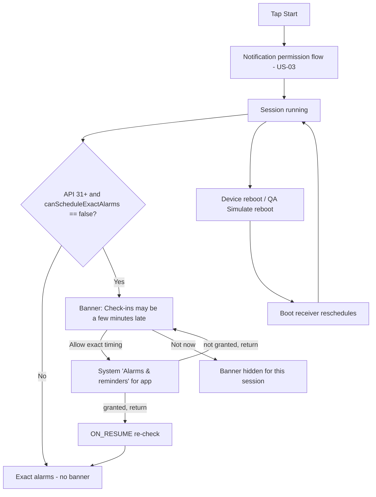

# US-05 — Reliable scheduling (exact alarms, reboot, permissions)

Story: `docs/product/user-stories.md#us-05` · Tokens: `design-system.md` · Status: Ready for Eng

Mostly engineering; design covers the **exact-timing banner**, permission-state surfacing, and debug affordances.

## 1. Flow



## 2. Exact-timing banner (Home slot A, priority 3)
`InfoBanner(attention)`, icon `ic_alarm`.
```
┌─────────────────────────────────────────────┐
│ (alarm) Check-ins may be a few minutes late │  titleSmall
│         Allow exact timing so they arrive   │  bodyMedium
│         right on schedule.                  │
│                    [Not now] [Allow exact timing]│  TextButtons, right-aligned
└─────────────────────────────────────────────┘
```
- Shown only while a session is **running or paused** (irrelevant when stopped) and exact alarms unavailable.
- **Not now** hides it until the next Start (persisted per session); it never nags more than once per session.
- **Allow exact timing** → `Settings.ACTION_REQUEST_SCHEDULE_EXACT_ALARM` with `package:` URI.
- Re-checked on `ON_RESUME` and on `AlarmManager.ACTION_SCHEDULE_EXACT_ALARM_PERMISSION_STATE_CHANGED`; disappears with `motion.medium` collapse.
- If both notifications-off and exact banners apply, notifications-off is first (US-01 §2.1.3).

## 3. Reboot
No UI. After reboot the next launch shows the same Home state (running, countdown). If the scheduled time passed while the phone was off, the boot receiver schedules the next alarm at **now + current interval** (no Missed recorded, no burst of notifications). Designer requirement: never show more than one notification after boot.

## 4. Notifications revoked while running
On `ON_RESUME`, if notifications are off → US-03 banner appears; session state stays "Running" (chip) but the countdown row gets a caption in `bodySmall` `onSurfaceVariant`: "Check-ins can't be shown until notifications are on."

## 5. Debug affordances (see US-02)
Short intervals toggle (readout "Short int. ON", interval line suffix "(short: 5 s)" — scale 1 min → 1 s per founder request, 2026-09-30), Simulate reboot, Preview: exact alarms denied, Preview: notifications off.

Short-interval scaling shown in UI: `Check-ins every 5 min (short: 5 s)` (L8 3 h → "(short: 180 s)").

## 6. Copy (exact)
| Key | Text |
|-----|------|
| banner_exact_title | Check-ins may be a few minutes late |
| banner_exact_body | Allow exact timing so they arrive right on schedule. |
| banner_exact_action | Allow exact timing |
| banner_not_now | Not now |
| countdown_notif_off_caption | Check-ins can't be shown until notifications are on. |
| interval_short_suffix | (short: %1$d s) |

## 7. Tokens
Banner `tertiaryContainer` / `onTertiaryContainer`, shape `medium`, padding 16dp, icon 24dp; actions `TextButton` (content `onTertiaryContainer`).

## 8. Motion
Banner enter/exit `expandVertically/shrinkVertically + fade`, `motion.medium`.

## 9. Accessibility
Banner merged: "Check-ins may be a few minutes late. Allow exact timing so they arrive right on schedule." Buttons focusable separately.

## 10. Test tags
`banner_exact`, `banner_exact_allow`, `banner_exact_not_now`, `qa_simulate_reboot`, `qa_short_intervals`.

## 11. Open questions
- **PM:** the story AC doesn't mention "Not now". Designer proposes it (respectful); if PM prefers, remove it — banner then stays until granted.
- **Eng:** `SCHEDULE_EXACT_ALARM` is pre-granted on API 31–32 and denied-by-default on 33+ for new installs — confirm banner copy works for both.
