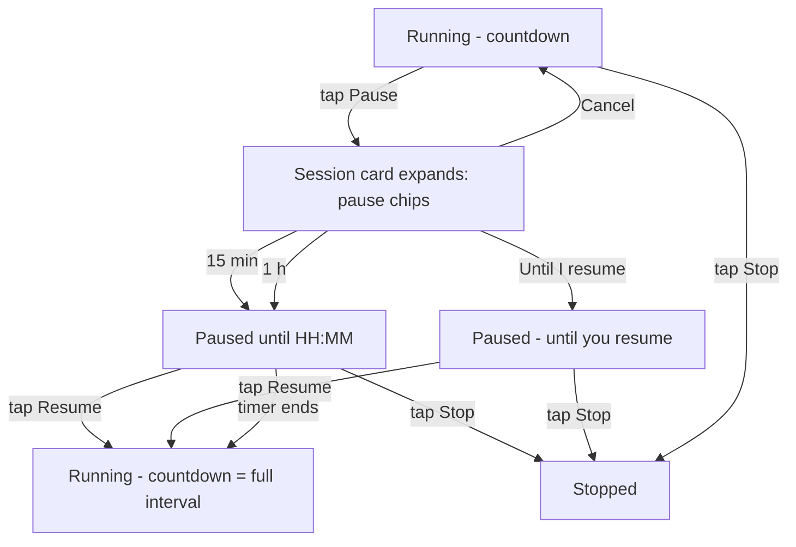

# US-06 — Next-alarm countdown, Pause & Resume

Story: `docs/product/user-stories.md#us-06` · Tokens: `design-system.md` · Status: Ready for Eng

## 1. Flow



## 2. Session card (Home slot D) — all states

### 2.1 Running
```
┌─────────────────────────────────────────────┐  Card surfaceContainer, large, pad 20dp
│ (● Running)                                 │  StatusChip running
│                                             │  16dp
│ NEXT CHECK-IN                               │  labelMedium onSurfaceVariant
│ in 12:34                                    │  "in" titleMedium onSurfaceVariant + "12:34" displaySmall tabular onSurface
│ at 14:32                                    │  bodyMedium onSurfaceVariant
│                                             │  20dp
│ ┌──────────────────┐  ┌──────────────────┐  │
│ │  ❚❚  Pause       │  │  ■  Stop         │  │  FilledTonalButton | OutlinedButton, 48dp, gap 12dp
│ └──────────────────┘  └──────────────────┘  │
└─────────────────────────────────────────────┘
```
Countdown format: `< 1 h` → `mm:ss` (e.g. `04:59`, leading zero); `≥ 1 h` → `h:mm:ss` (e.g. `1:59:59`). Ticks each second; tabular digits; never negative (show `00:00` while the alarm is being posted). The combined AC text "Next check-in in mm:ss" is the accessibility label and also the literal content: overline "NEXT CHECK-IN" + "in 12:34" — for the QA screenshot the visible string reads **"Next check-in in 12:34"** when read across; if PM needs a single literal line, render `bodyLarge` "Next check-in in 12:34" instead of the overline+display pair on compact heights < 640dp. (Designer preference: overline + display.)

### 2.2 Pause picker (inline expansion — no bottom sheet, tap-only)
Tapping **Pause** replaces the button row (cross-fade, height animates):
```
│ Pause check-ins for…                        │  titleSmall onSurface
│ ( 15 min ) ( 1 h ) ( Until I resume )       │  3 SuggestionChips-as-buttons: FilterChip style, 48dp touch, 32dp visual
│                                   [Cancel]  │  TextButton
```
- Chips: `AssistChip` with `labelLarge`; tapping one applies immediately (no confirm). Leading icon only on "Until I resume": `ic_pause` 18dp.
- Chip row wraps (`FlowRow`, 8dp gaps) at large font.
- Snackbar after choosing: "Paused until 15:47" / "Paused until you resume".

### 2.3 Paused (timed)
```
│ (● Paused)                                  │  StatusChip paused
│ PAUSED UNTIL                                │  labelMedium
│ 15:47                                       │  displaySmall tabular
│ Check-ins resume automatically.             │  bodyMedium onSurfaceVariant
│ ┌──────────────────┐  ┌──────────────────┐  │
│ │  ▶  Resume       │  │  ■  Stop         │  │  Button (filled primary) | OutlinedButton
│ └──────────────────┘  └──────────────────┘  │
```
AC literal "Paused until HH:MM" is the merged a11y label; visible as overline + time (same rationale as 2.1).

### 2.4 Paused (until resume)
```
│ (● Paused)                                  │
│ Paused until you resume                     │  titleLarge onSurface
│ Your level is kept.                         │  bodyMedium onSurfaceVariant
│ [ ▶  Resume ]      [ ■  Stop ]              │
```

### 2.5 Stopped — see US-03 §2.1.

### 2.6 Level kept note
Pause/Stop never change level. The level card is untouched.

## 3. Behaviour details
- Resume → next alarm = now + current interval → countdown shows full interval (L1 → `05:00`, then `04:59`...).
- Timed pause end while app is open → card animates from Paused to Running; snackbar "Check-ins resumed".
- Pause while a check-in is pending: pending notification stays answerable; the pending card stays. (Answering while paused updates level but does **not** schedule a new alarm until resume.)
- Stop from Paused → Stopped, snackbar "Check-ins stopped. Your level is saved."

## 4. Copy (exact)
| Key | Text |
|-----|------|
| next_overline | NEXT CHECK-IN |
| next_in | in %1$s |
| next_at | at %1$s |
| next_a11y | Next check-in in %1$s, at %2$s |
| pause_title | Pause check-ins for… |
| pause_15 | 15 min |
| pause_60 | 1 h |
| pause_indef | Until I resume |
| pause_cancel | Cancel |
| session_paused | Paused |
| paused_until_overline | PAUSED UNTIL |
| paused_until_a11y | Paused until %1$s |
| paused_auto_resume | Check-ins resume automatically. |
| paused_indef_title | Paused until you resume |
| paused_level_kept | Your level is kept. |
| action_resume | Resume |
| snackbar_paused_until | Paused until %1$s |
| snackbar_paused_indef | Paused until you resume |
| snackbar_resumed | Check-ins resumed |

## 5. Tokens
Chip paused: `secondaryContainer`. Resume: filled `primary`. Pause: `FilledTonalButton` (`secondaryContainer`). Stop: `OutlinedButton`. Countdown `displaySmall` + `tnum`.

## 6. Motion
- Button row ↔ pause picker: `AnimatedContent` fade + size transform `motion.medium`.
- Running ↔ Paused: chip colour `motion.short`; content cross-fade `motion.medium`.
- Countdown: no animation.

## 7. Accessibility
- Countdown: merged semantic label **minutes-only** (revised 2026-10-01): "Next check-in in 13 minutes, at 2:32 PM" — minutes **rounded to nearest** (02:59 → "3 minutes"), ≥ 1 h → "in 1 hour 5 minutes"; under 1 minute → "in less than a minute". **Not** a live region. Update contentDescription at most every 60 s to avoid TalkBack churn (visual still ticks). The absolute "at HH:MM" carries the precision.
- Chips are buttons (`Role.Button`), 48dp min touch.
- At fontScale ≥ 1.5 buttons stack vertically (Resume/Pause above Stop), full width.

## 8. Test tags
`session_card`, `status_chip`, `countdown`, `countdown_at`, `btn_pause`, `pause_chip_15`, `pause_chip_60`, `pause_chip_indef`, `pause_cancel`, `paused_until`, `btn_resume`, `btn_stop`.

## 9. Open questions
- **PM:** AC wording "Next check-in in mm:ss" — accept overline+display layout (a11y label carries the exact phrase)? Designer recommends yes.
- **PM:** answering a pending check-in while paused — confirm "update level, no new alarm until resume".
