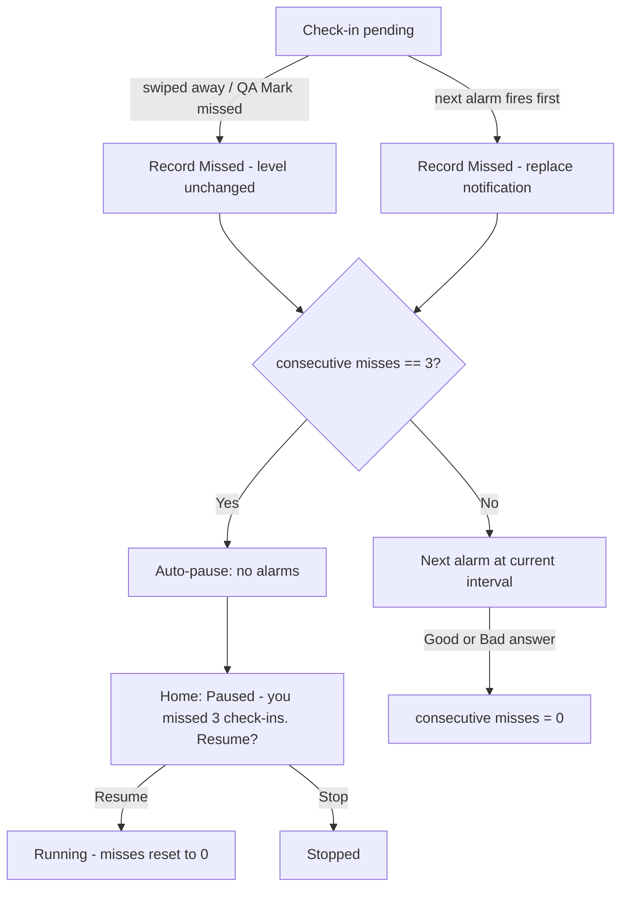

# US-07 — Missed check-ins & auto-pause

Story: `docs/product/user-stories.md#us-07` · Tokens: `design-system.md` · Status: Ready for Eng

**Tone:** Missed is neutral. No red, no guilt. Grey `missed` tokens only.

## 1. Flow



## 2. Home — auto-paused session card (slot D)
Replaces the normal paused layout.
```
┌─────────────────────────────────────────────┐  Card surfaceContainer
│ (● Paused)                                  │  StatusChip paused
│ ┌─────────────────────────────────────────┐ │  inner InfoBanner(attention), no icon row wrap
│ │ (schedule) Paused — you missed 3        │ │  titleSmall onTertiaryContainer
│ │            check-ins. Resume?           │ │
│ │ No worries — we stopped so we won't     │ │  bodyMedium
│ │ nag you while you're away.              │ │
│ └─────────────────────────────────────────┘ │
│ ┌──────────────────┐  ┌──────────────────┐  │
│ │  ▶  Resume       │  │  ■  Stop         │  │  Button filled | OutlinedButton
│ └──────────────────┘  └──────────────────┘  │
└─────────────────────────────────────────────┘
```
- Not a Home-top banner (keeps the explanation next to the Resume control).
- Resume → running, countdown = full current interval, misses = 0, snackbar "Check-ins resumed".
- No notification is posted for auto-pause (silence is the point). The last missed notification is already gone.

## 3. Missed in other surfaces
- **Pending card** (US-03): when a new alarm replaces a pending one while app is open, the card's overline time updates (no extra UI). Optional subtle line under the body when misses ≥ 1: bodySmall `onPrimaryContainer` 70% — "Missed the last one — that's fine." (only when consecutive misses ≥ 1).
- **Today tiles / Stats / History**: Missed uses `missedContainer` + `ic_missed`.
- **Session card while running** with misses 1–2: no indicator (avoid guilt). Visible only in the QA readout.

## 4. Copy (exact)
| Key | Text |
|-----|------|
| autopause_title | Paused — you missed 3 check-ins. Resume? |
| autopause_body | No worries — we stopped so we won't nag you while you're away. |
| pending_missed_hint | Missed the last one — that's fine. |
| history_missed | Missed |
| qa_marked_missed | Marked missed (%1$d in a row) |
| qa_no_pending | No pending check-in |

## 5. Tokens
Inner banner `tertiaryContainer`/`onTertiaryContainer`, shape `medium`, padding 16dp, icon `ic_missed` 24dp. Missed semantic tokens for stats/history.

## 6. Motion
Transition Running → Auto-paused: card content cross-fade `motion.medium`. Nothing celebratory or shaking.

## 7. Accessibility
Auto-pause banner: polite live region on appearance (if app open). Merged label "Paused. You missed 3 check-ins. Resume?" then Resume button focus next.

## 8. Test tags
`autopause_banner`, `btn_resume`, `btn_stop`, `pending_missed_hint`, `qa_mark_missed`, `qa_state_misses`.

## 9. Open questions
- **PM:** confirm the optional "Missed the last one — that's fine." hint on the pending card (Designer: include; reassures without guilt).
