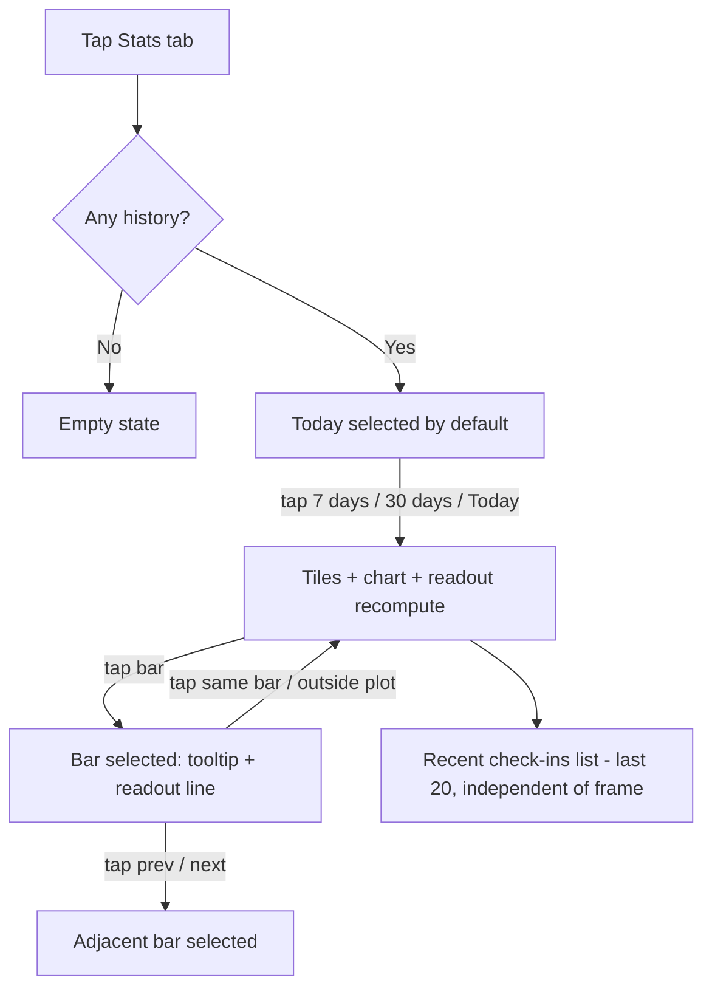

# US-08 — Stats: Good/Bad charts with time frames (+ Home "Today" summary)

Story: `docs/product/user-stories.md#us-08` · Tokens: `design-system.md` §2.4, §11 · Status: Ready for Eng

Charts are drawn with **Compose `Canvas`** (no chart library). Everything below is specified to the dp.

## 1. Flow



## 2. Stats screen layout (compact, 360dp wide)

```
┌──────────────────────────────────────────────┐
│ Stats                                        │  TopAppBar
├──────────────────────────────────────────────┤
│ ┌ Today ✓ │ 7 days │ 30 days ┐               │  SingleChoiceSegmentedButtonRow, full width, 48dp
│                                              │  16dp
│ ┌───────────────────┐ ┌───────────────────┐  │  StatTile 2×2 grid, gap 8dp
│ │ ✓ GOOD            │ │ ✕ BAD             │  │  goodContainer | badContainer
│ │ 5                 │ │ 2                 │  │
│ └───────────────────┘ └───────────────────┘  │
│ ┌───────────────────┐ ┌───────────────────┐  │
│ │ ◷ MISSED          │ │ % GOOD RATE       │  │  missedContainer | surfaceContainerHigh
│ │ 1                 │ │ 71%               │  │
│ └───────────────────┘ └───────────────────┘  │
│ ┌──────────────────────────────────────────┐ │  Streak tile (full width) surfaceContainerHigh
│ │ (fire) STREAK   4 days                   │ │  label + headlineSmall inline
│ │ Days in a row with a Good rate of 50%+   │ │  bodySmall onSurfaceVariant
│ └──────────────────────────────────────────┘ │
│                                              │  12dp
│ ┌──────────────────────────────────────────┐ │  Chart card: surfaceContainer, large, pad 16dp
│ │ Check-ins per hour                       │ │  titleMedium (per hour | per day)
│ │ ■ Good   ▨ Bad                           │ │  Legend, labelMedium, 8dp below title
│ │  4 ┤- - - - - - - - - - - - - - - - - -  │ │
│ │    │                                     │ │
│ │  2 ┤- - - - - -▨- - - - - - - - - - - -  │ │  plot 176dp high
│ │    │        ▨ █ █ ▨ █ █ █                │ │
│ │  0 ┼──────────────────────────────────── │ │  baseline
│ │    00     06     12     18               │ │  x labels 24dp
│ │ ┌──────────────────────────────────────┐ │ │
│ │ │(<) Tap a bar to see details       (>)│ │ │  Readout row 48dp (§4.7)
│ │ └──────────────────────────────────────┘ │ │
│ └──────────────────────────────────────────┘ │
│                                              │  24dp
│ Recent check-ins                             │  titleMedium
│ ┌──────────────────────────────────────────┐ │  Card surfaceContainer
│ │ (✓) Good                          17:35  │ │  HistoryRow ×20
│ │     Level 3 · Aware                      │ │
│ │ (◷) Missed                        11:40  │ │
│ │     Level 3 · Aware                      │ │
│ │ ...                                      │ │
│ └──────────────────────────────────────────┘ │
└──────────────────────────────────────────────┘
```
Whole screen is one `LazyColumn` (history rows are lazy items inside a card-styled section: first/last items get the card's top/bottom corners).

Expanded width (≥ 840dp): two columns — left (max 480dp): selector, tiles, streak, chart; right (max 480dp): Recent check-ins. 24dp gap.

## 3. Time-frame selector
- `SingleChoiceSegmentedButtonRow` with 3 `SegmentedButton`s: **Today** · **7 days** · **30 days**. Default **Today**; choice saved with `rememberSaveable` (not persisted across app restarts — always opens on Today, for deterministic QA).
- Frames (local time zone):
  - Today: from local midnight to midnight (24 hourly buckets 00–23).
  - 7 days: today + previous 6 calendar days (7 daily buckets, oldest left).
  - 30 days: today + previous 29 calendar days (30 daily buckets).
- Changing frame clears bar selection.

## 4. Chart spec (Canvas)

### 4.1 Geometry
| Element | Value |
|---------|-------|
| Card padding | 16dp |
| Title → legend | 8dp; legend → plot top 16dp |
| Plot height | 176dp (excludes x labels) |
| Y-axis label column | 28dp wide, labels right-aligned, 4dp gap to plot |
| X-axis label row | 24dp high, labels top-aligned 6dp below baseline |
| Plot width | card content width − 32dp (y column + gap) |
| Slot width | plotWidth / n (n = 24, 7 or 30) |
| Bar width | Today: `slot × 0.6`; 7 days: `min(slot × 0.5, 32dp)`; 30 days: `slot × 0.7`; minimum 3dp |
| Bar x | centred in slot |
| Bar top corner radius | 4dp (2dp if bar width < 8dp); bottom square |
| Stack gap (Good↔Bad) | 1dp, filled with card colour (`surfaceContainer`) |
| Min visible segment | a non-zero segment is at least 2dp tall |

### 4.2 Y scale
- `maxStack` = max over buckets of (Good + Bad).
- `yMax` = first value ≥ maxStack from `[2, 4, 6, 8, 10, 12, 16, 20, 30, 40, 50, 60, 80, 100, 150, 200]` (all even so the midline is an integer). If `maxStack == 0`, `yMax = 2`.
- Gridlines + labels at `0`, `yMax/2`, `yMax`.
- Gridlines: `outlineVariant`, 1dp, dash 4dp/4dp. Baseline (0): solid `outline` 1dp.
- Y labels: `labelSmall` + `tnum`, `onSurfaceVariant`, vertically centred on their line.

### 4.3 Bars
- **Stacked:** Good at the bottom (`good`), Bad stacked on top (`bad`).
- **Bad hatch pattern:** after filling the Bad rect, clip to it and draw 45° lines (bottom-left → top-right), stroke 1.5dp, spacing 5dp, colour `onBad` at 35% alpha. Legend swatch uses the same pattern. (Makes Good/Bad distinguishable in grayscale/colour-blindness.)
- Zero bucket: nothing drawn (just the baseline).
- Today frame: future hours (after the current hour) are rendered with nothing, but their x-slot is still tappable (readout "No check-ins").

### 4.4 X labels
`labelSmall` + `tnum`, `onSurfaceVariant`, centred under their slot.
| Frame | Labels |
|-------|--------|
| Today | Bars 0, 6, 12, 18 → "00", "06", "12", "18" (12-hour locale: "12a", "6a", "12p", "6p") |
| 7 days | Every bar: weekday short ("Mon"…); the last bar "Today" (`labelSmall` weight 700, `onSurface`) |
| 30 days | Bars 0, 7, 14, 21 → short date ("Sep 1" / locale `MMMd` skeleton); bar 29 → "Today" |

### 4.5 Legend
Row above plot: `[12dp rounded-2dp swatch good] Good` 16dp gap `[12dp swatch bad + hatch] Bad`. `labelMedium`, `onSurfaceVariant`. Missed is **not** charted (shown in tiles/readout).

### 4.6 Selection (tap)
- Hit area per bucket = full slot width × (plot + x-label) height. Tap selects; tapping the selected bucket or empty card space outside the plot deselects.
- Selected state: all other bars drawn at 40% alpha; selected bar full alpha; a 2dp `onSurface` underline under the selected slot's x-label area (below the baseline, 12dp wide, rounded).
- **Tooltip:** `inverseSurface` rounded `small` (8dp), padding 8dp×6dp, `bodySmall` `inverseOnSurface`, 2dp shadow, anchored 8dp above the bar top (or above the baseline for empty buckets), horizontally centred but clamped within the plot; content two lines:
  - Line 1: bucket label — Today: "14:00–15:00"; days: "Tue, Sep 29".
  - Line 2: "8 Good · 2 Bad".
- Tooltip appears with fade `motion.short`.

### 4.7 Readout row (tap-verifiable + accessible alternative to tiny bars)
Row under the chart, 48dp tall, inside the chart card:
```
(<)  Tue, Sep 29 · 8 Good · 2 Bad · 0 Missed  (>)
```
- `IconButton`s 48dp `ic_chevron_left` (add Material Symbol `chevron_left`) / `ic_chevron_right`: select previous/next bucket (if none selected, `<` selects the last bucket, `>` the first). Disabled at the ends.
- Text `bodyMedium` `onSurface`, centred, `tnum`, 2 lines max. Nothing selected: "Tap a bar to see details" in `onSurfaceVariant`.
- The readout is what QA screenshots to verify "tapping a bar shows its exact counts" (tooltip may overlap; readout never does).

### 4.8 Animation
On frame change and on first show: bars grow from baseline, `motion.long` (500ms), stagger 10ms per bar capped at 300ms total; y-labels cross-fade. Reduced motion: instant.

### 4.9 Chart states
| State | Display |
|-------|---------|
| Frame has data | as above |
| Frame empty (but history exists) | Axes with yMax = 2, no bars; centred in plot `bodyMedium` `onSurfaceVariant` "No check-ins in this period"; readout hidden |
| No history at all | Whole-screen empty state (§6) |

### 4.10 Illustrative (non-production) draw order
```kotlin
// NON-PRODUCTION sketch — for intent only
Canvas(Modifier.fillMaxWidth().height(200.dp)) {
    drawGridlines(yMax)          // dashed outlineVariant; solid outline baseline
    buckets.forEachIndexed { i, b ->
        val alpha = if (selected == null || selected == i) 1f else 0.4f
        drawGoodSegment(i, b.good, alpha)       // good
        drawBadSegmentWithHatch(i, b.bad, alpha) // bad + 45° onBad@35% lines
    }
    drawXLabels(); drawYLabels()    // via TextMeasurer, labelSmall + tnum
}
```

## 5. Tiles
- Grid 2×2, gap 8dp, each `StatTile` (design-system §9.5), min height 88dp.
- Values for selected frame:
  - **Good** = count Good; **Bad** = count Bad; **Missed** = count Missed.
  - **Good rate** = `round(100 × Good / (Good + Bad))` + "%"; Missed excluded. If Good + Bad = 0 → "—".
- **Streak tile** (full width, independent of frame): consecutive calendar days ending today with ≥ 1 answer (Good or Bad) and Good rate ≥ 50%. If today has no answers yet, count ending yesterday (today doesn't break the streak until it's over). Value "N days" / "1 day" / "0 days". Supporting "Days in a row with a Good rate of 50%+".
- At fontScale ≥ 1.5 tiles become 1 column.

## 6. Empty state (no history at all)
Centred in the space below the selector (selector stays visible but tiles/chart/history hidden):
```
         (bar_chart 48dp, onSurfaceVariant)
              No check-ins yet            titleMedium
          Tap Start on Home to begin.     bodyMedium onSurfaceVariant
              [ Go to Home ]              FilledTonalButton 48dp → switches tab to Home
```
Exact AC copy: title+body read together = "No check-ins yet — tap Start on Home". To match the AC literal, the **title is "No check-ins yet"** and body **"Tap Start on Home to begin."**; the merged a11y label is "No check-ins yet — tap Start on Home to begin."

## 7. Recent check-ins list
- Last **20** events across all time (not filtered by frame), newest first.
- `HistoryRow` (design-system §9.6): badge (Good `goodContainer`+`ic_good`, Bad `badContainer`+`ic_bad`, Missed `missedContainer`+`ic_missed`), headline "Good"/"Bad"/"Missed", supporting "Level {n} · {name}" (level *at the time* of the event, before the answer was applied), trailing time:
  - today: "17:35"; yesterday: "Yesterday 17:35"; older: "Sep 27, 17:35" (locale skeleton `MMMd` + `Hm`/`hm`).
- If fewer than 20, show what exists. No "See all" in v1.

## 8. Home "Today" summary (slot E)
Overline "TODAY" (`labelMedium`, `onSurfaceVariant`, 8dp below), then 3 equal `StatTile`s in a row (gap 8dp): Good, Bad, Missed — compact variant: min height 72dp, label `labelMedium` with 18dp icon, value `headlineSmall`. Tapping the row navigates to Stats (Today). Whole row `Role.Button`, contentDescription "Today: 5 Good, 2 Bad, 1 Missed. Open stats." At fontScale ≥ 1.5 the three tiles stack vertically.

## 9. Deterministic seed (debug "Seed sample history (30 days)")
Replaces existing history; does **not** change current level/state. Day `d` = calendar days ago (0 = today). For past days, events start at **08:00** and are spaced **45 min** apart; answers follow the fixed pattern for the day type (index k = 0, 1, 2 …), then the day's Missed event(s) follow at the next slot(s).

| Day type | Answer pattern (k = 0 →) |
|----------|--------------------------|
| 6 Good / 4 Bad | G B G B G B G B G G |
| 7 Good / 3 Bad | G B G G B G G B G G |
| 8 Good / 2 Bad | G B G G G B G G G G |
| 3 Good / 6 Bad (day 10) | B B B G B B G B G |

| Days ago | Good | Bad | Missed |
|----------|-----:|----:|-------:|
| 29 … 15 (15 days) | 6 | 4 | 1 |
| 14 … 11, 9 … 8 (6 days) | 7 | 3 | 1 |
| 10 | 3 | 6 | 1 |
| 7, 6, 5, 3, 2, 1 (6 days) | 8 | 2 | 0 |
| 4 | 0 | 0 | 0 (rest day) |
| 0 (today) | 5 | 2 | 1 |

Today (explicit): 08:05 Bad · 09:10 Good · 10:15 Good · 11:40 Missed · 12:20 Bad · 14:25 Good · 15:30 Good · 17:35 Good. (Timestamps may be in the future if seeding before 17:35 — acceptable in debug; QA should seed and screenshot after 18:00 local, or accept future-dated rows.)

**Level at each event:** replay the SRS engine from L1/0 over the seeded events in chronological order (Missed = no change) and store the resulting "level before answer" on each event.

**Expected values (for QA assertions):**
| Frame | Good | Bad | Missed | Good rate |
|-------|-----:|----:|-------:|----------:|
| Today | 5 | 2 | 1 | 71% |
| 7 days | 45 | 12 | 1 | 79% |
| 30 days | 188 | 98 | 23 | 66% |
| **Streak** | — | — | — | **4 days** (today + days 1–3; day 4 empty) |

Total events: 309. Today chart: bars at hours 08 (B1), 09 (G1), 10 (G1), 12 (B1), 14 (G1), 15 (G1), 17 (G1); yMax = 2. 7-day chart yMax = 10; 30-day chart yMax = 10 (max stack 10: days with 6G+4B / 7G+3B / 8G+2B; day 10 = 9).

## 10. Copy (exact)
| Key | Text |
|-----|------|
| stats_title | Stats |
| frame_today / frame_7d / frame_30d | Today / 7 days / 30 days |
| tile_good / tile_bad / tile_missed / tile_rate | Good / Bad / Missed / Good rate |
| tile_rate_empty | — |
| tile_streak | Streak |
| streak_value | %1$d days *(plural: 1 day)* |
| streak_support | Days in a row with a Good rate of 50%+ |
| chart_title_hourly | Check-ins per hour |
| chart_title_daily | Check-ins per day |
| legend_good / legend_bad | Good / Bad |
| chart_today_label | Today |
| chart_empty_period | No check-ins in this period |
| readout_hint | Tap a bar to see details |
| readout_value | %1$s · %2$d Good · %3$d Bad · %4$d Missed |
| tooltip_counts | %1$d Good · %2$d Bad |
| readout_prev_cd / readout_next_cd | Previous bar / Next bar |
| empty_title | No check-ins yet |
| empty_body | Tap Start on Home to begin. |
| empty_action | Go to Home |
| history_title | Recent check-ins |
| history_level | Level %1$d · %2$s |
| history_yesterday | Yesterday %1$s |
| home_today_overline | TODAY |
| qa_seeded | Seeded 30 days (%1$d events) |

## 11. Tokens
Chart card `surfaceContainer`, shape `large`, padding 16dp; bars `good` / `bad` (+ hatch `onBad` 35%); grid `outlineVariant`; baseline `outline`; axis text `labelSmall` `onSurfaceVariant`; tooltip `inverseSurface`/`inverseOnSurface`, shape `small`; tiles per design-system §9.5.

## 12. Accessibility
- Chart `Canvas` has a merged contentDescription summarising the frame: "Check-ins per day, last 7 days. 45 Good, 12 Bad. Highest: Tue, Sep 29 with 8 Good and 2 Bad."
- Each bucket exposes a virtual semantics node (via `Modifier.semantics` on an invisible `Row` of slot-sized `Box`es layered over the canvas) with label "Tue, Sep 29: 8 Good, 2 Bad, 0 Missed" and `onClick` = select. This also gives QA/UiAutomator targetable nodes.
- Prev/Next buttons give ≥ 48dp targets even when bars are 10dp wide (30-day frame).
- Good/Bad never colour-only: legend labels, hatch pattern, stacking order, readout words.
- Tiles are single nodes: "Good rate: 71 percent".

## 13. Test tags
`stats_frame_today`, `stats_frame_7d`, `stats_frame_30d`, `tile_good`, `tile_bad`, `tile_missed`, `tile_rate`, `tile_streak`, `chart`, `chart_bar_{index}` (virtual slot nodes), `chart_readout`, `chart_prev`, `chart_next`, `stats_empty`, `stats_empty_go_home`, `history_list`, `history_row_{index}`, `home_today_row`.

## 14. Open questions
- **Eng:** Canvas custom chart estimate — Designer believes ~1–1.5 days incl. semantics overlay; no library needed.
- **PM:** Good rate excludes Missed (Designer proposal). Confirm.
- **PM:** Streak counting when today has no answers yet (ends yesterday) — confirm.
- **PM/QA:** Seed "today" events may be future-dated before 17:35 — acceptable, or should the seed shift today's events to end at the current time?
