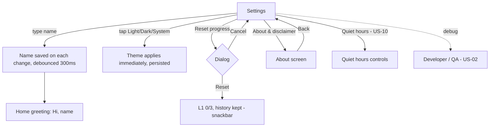

# US-09 — Settings: name, theme, reset (+ About)

Story: `docs/product/user-stories.md#us-09` · Tokens: `design-system.md` · Status: Ready for Eng

## 1. Flow



## 2. Settings screen (compact)
`TopAppBar` "Settings"; scrollable column; groups are `Card`s (`surfaceContainer`, shape `large`) with `ListItem`s (container transparent) and a group header above each card.

```
┌─────────────────────────────────────────────┐
│ Settings                                    │  TopAppBar
├─────────────────────────────────────────────┤
│ PROFILE                                     │  titleSmall primary, 16dp start, 8dp below
│ ┌─────────────────────────────────────────┐ │
│ │ ┌ Your name ───────────────────────────┐│ │  OutlinedTextField, full width, leading ic_person
│ │ │ (person) Alex                    (x) ││ │  trailing clear icon when non-empty
│ │ └──────────────────────────────────────┘│ │
│ │ Shown in your greeting on Home.         │ │  supportingText
│ └─────────────────────────────────────────┘ │
│ APPEARANCE                                  │
│ ┌─────────────────────────────────────────┐ │
│ │ (palette) Theme                         │ │  ListItem headline
│ │ [ Light | Dark | System ]               │ │  SingleChoiceSegmentedButtonRow, full width, 48dp
│ └─────────────────────────────────────────┘ │
│ CHECK-INS                                   │  (US-10 content — see US-10 doc)
│ ┌─────────────────────────────────────────┐ │
│ │ (bedtime) Quiet hours           [ ●]    │ │
│ │ ...                                     │ │
│ └─────────────────────────────────────────┘ │
│ PROGRESS                                    │
│ ┌─────────────────────────────────────────┐ │
│ │ (restart) Reset progress                │ │  ListItem, headline in `error` color, 56dp
│ │ Go back to Level 1. History is kept.    │ │  supporting
│ └─────────────────────────────────────────┘ │
│ ABOUT                                       │
│ ┌─────────────────────────────────────────┐ │
│ │ (info) About & disclaimer           (>) │ │
│ │ Version 1.0                             │ │
│ └─────────────────────────────────────────┘ │
│ DEVELOPER (debug only)                      │
│ ┌─────────────────────────────────────────┐ │
│ │ (bug) Developer / QA                (>) │ │
│ └─────────────────────────────────────────┘ │
└─────────────────────────────────────────────┘
```

- **Name field:** single line, `KeyboardOptions(capitalization = Words, imeAction = Done)`, max 24 chars (counter shown only when ≥ 20: "22/24"), trimmed on save; empty → "Hi there". Saved as the user types (debounced) — no Save button.
- **Theme:** segmented buttons with check icon on selected (M3 default). Order Light, Dark, System. Default System.
- **Reset progress:** tap → dialog.

## 3. Reset dialog
`AlertDialog` (surfaceContainerHigh, shape extraLarge), icon `ic_restart`.
```
            (restart)
      Reset your progress?
  You'll go back to Level 1 (0 of 3).
  Your check-in history stays.
                      [Cancel]  [Reset]
```
- **Reset**: `TextButton` with `error` content color. **Cancel**: `TextButton` default.
- After Reset: snackbar "Progress reset to Level 1". If a session is running, it continues with L1 interval from now (next alarm = now + 5 min).

## 4. About screen
`TopAppBar` with back, title "About".
```
│ (sentiment_calm 48dp in 72dp primaryContainer circle)        │
│ SuperUnclench                                  headlineSmall │
│ Version 1.0 (1)                         bodyMedium variant   │
│                                                              │
│ ┌ InfoBanner(neutral) ──────────────────────────────────────┐│
│ │ (info) SuperUnclench is an awareness tool, not medical    ││
│ │ advice. If you have jaw pain, talk to a dentist or doctor.││
│ └───────────────────────────────────────────────────────────┘│
│ How it works                                   titleMedium   │
│ SuperUnclench checks in now and then to ask if your jaw is   │
│ relaxed. Answer Good or Bad. The more often you're relaxed,  │
│ the less often it asks.                        bodyLarge     │
```
Version from `BuildConfig.VERSION_NAME` (`VERSION_CODE`).

## 5. Copy (exact)
| Key | Text |
|-----|------|
| settings_title | Settings |
| settings_group_profile | Profile |
| settings_name_label | Your name |
| settings_name_support | Shown in your greeting on Home. |
| settings_name_clear_cd | Clear name |
| settings_group_appearance | Appearance |
| settings_theme | Theme |
| theme_light / theme_dark / theme_system | Light / Dark / System |
| settings_group_checkins | Check-ins |
| settings_group_progress | Progress |
| settings_reset | Reset progress |
| settings_reset_support | Go back to Level 1. History is kept. |
| reset_dialog_title | Reset your progress? |
| reset_dialog_body | You'll go back to Level 1 (0 of 3). Your check-in history stays. |
| reset_dialog_confirm | Reset |
| reset_dialog_cancel | Cancel |
| snackbar_reset | Progress reset to Level 1 |
| settings_group_about | About |
| settings_about | About & disclaimer |
| settings_version | Version %1$s |
| about_title | About |
| about_how_title | How it works |
| about_how_body | SuperUnclench checks in now and then to ask if your jaw is relaxed. Answer Good or Bad. The more often you're relaxed, the less often it asks. |
| settings_group_developer | Developer |
| settings_qa | Developer / QA |
| settings_qa_support | Debug build only |

Group headers: sentence case ("Profile"), `titleSmall` `primary` (M3 settings convention). Uppercase in the wireframe is illustrative only.

## 6. Tokens
Groups `surfaceContainer`, shape `large`, 8dp gap header→card, 24dp between groups; ListItem 56dp (one-line) / 72dp (two-line); icons 24dp `onSurfaceVariant`; destructive text `error`.

## 7. Motion
Theme switch: instant recomposition; no custom animation (M3 animates colours by default ~ fine). Dialog: M3 default.

## 8. Accessibility
- Name field has label + supporting text; clear button contentDescription "Clear name".
- Segmented buttons announce "Theme, Dark, selected, 2 of 3".
- Reset dialog: focus to title; confirm button is last.

## 9. Test tags
`settings_name_field`, `settings_name_clear`, `theme_light`, `theme_dark`, `theme_system`, `settings_reset`, `dialog_reset_confirm`, `dialog_reset_cancel`, `settings_about`, `settings_qa`, `about_disclaimer`, `about_version`.

## 10. Open questions
- **PM:** 24-char name limit OK?
- **PM:** Reset while running — Designer proposes the session continues at L1 (not stopped).
