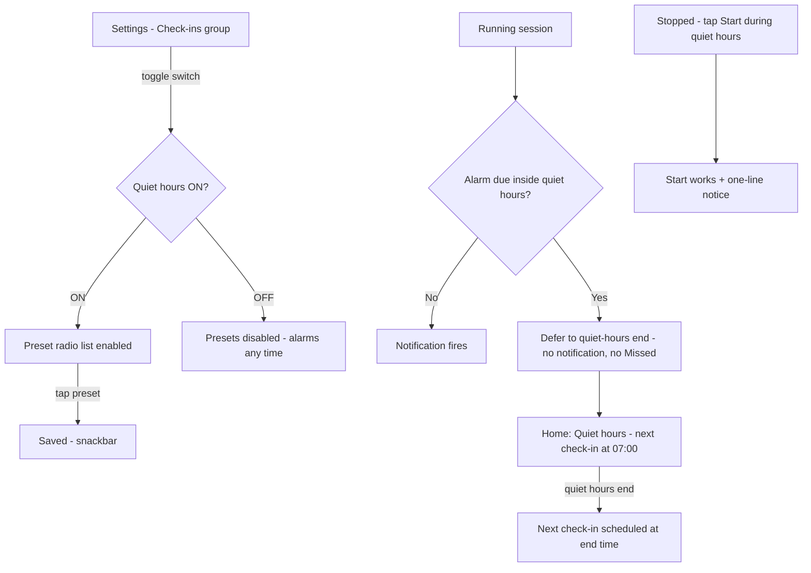

# US-10 — Quiet hours

Story: `docs/product/user-stories.md#us-10` · Tokens: `design-system.md` · Status: Ready for Eng

## 1. Flow



## 2. Settings — Check-ins group
```
│ Check-ins                                        │  group header titleSmall primary
│ ┌──────────────────────────────────────────────┐ │  Card surfaceContainer, large
│ │ (bedtime) Quiet hours                  [●  ] │ │  ListItem 72dp, trailing Switch (whole row toggles)
│ │           No check-ins overnight.            │ │  supporting
│ │ ──────────────────────────────────────────── │ │  outlineVariant 1dp, inset 16dp
│ │   (•) 22:00 – 07:00                          │ │  RadioButton ListItems 56dp,
│ │   ( ) 23:00 – 08:00                          │ │  indented 56dp (aligned to text above)
│ │   ( ) 21:00 – 06:00                          │ │
│ └──────────────────────────────────────────────┘ │
```
- Default ON, 22:00–07:00.
- Switch OFF: radio rows stay visible but disabled (38% alpha) so the chosen preset is remembered.
- Times formatted per system 24h/12h setting ("10:00 PM – 7:00 AM"). Separator en dash with thin spaces.
- Snackbar on change: "Quiet hours 23:00–08:00" / "Quiet hours off" / "Quiet hours on".
- Whole row tappable for radio (`Modifier.selectable(role = Role.RadioButton)`) and switch (`toggleable(role = Role.Switch)`).

## 3. Home during quiet hours
### 3.1 Session card (running, inside quiet hours with deferred alarm)
```
┌─────────────────────────────────────────────┐
│ (● Running) (bedtime Quiet hours)           │  StatusChip running + StatusChip quiet
│ QUIET HOURS                                 │  labelMedium onSurfaceVariant
│ Next check-in at 07:00                      │  titleLarge onSurface (tabular)
│ Rest easy — no check-ins until then.        │  bodyMedium onSurfaceVariant
│ [ ❚❚ Pause ]        [ ■ Stop ]              │
└─────────────────────────────────────────────┘
```
AC literal: **"Quiet hours — next check-in at 07:00"** = merged a11y label; the visible text shows overline "QUIET HOURS" + "Next check-in at 07:00". (If PM wants the literal on one line, use `titleMedium` "Quiet hours — next check-in at 07:00" — Designer prefers the two-line version.)
- The countdown is replaced by the absolute time (a 9-hour countdown is not useful at night).
- Greeting subtitle: "Quiet hours — rest easy." (US-01 table).
- Show this state as soon as "now" is inside quiet hours and the session is running (not only after an alarm was deferred), since any alarm due inside the window is deferred to its end anyway.

### 3.2 Start during quiet hours (stopped)
Start works. Session card shows the quiet-hours running state above, plus a one-shot snackbar: "Started. First check-in at 07:00, after quiet hours."

### 3.3 Stopped during quiet hours
No quiet-hours UI (irrelevant).

## 4. Debug (US-02)
"Simulate quiet hours now: ON" makes the app treat now as inside the current preset's window; readout shows "sim: ON". Home shows §3.1 with end time from the preset (07:00 for default).

## 5. Copy (exact)
| Key | Text |
|-----|------|
| quiet_title | Quiet hours |
| quiet_support | No check-ins overnight. |
| quiet_preset_22 | 22:00 – 07:00 |
| quiet_preset_23 | 23:00 – 08:00 |
| quiet_preset_21 | 21:00 – 06:00 |
| quiet_chip | Quiet hours |
| quiet_overline | QUIET HOURS |
| quiet_next_at | Next check-in at %1$s |
| quiet_a11y | Quiet hours — next check-in at %1$s |
| quiet_body | Rest easy — no check-ins until then. |
| quiet_start_snackbar | Started. First check-in at %1$s, after quiet hours. |
| snackbar_quiet_preset | Quiet hours %1$s |
| snackbar_quiet_on / off | Quiet hours on / Quiet hours off |

## 6. Tokens
Quiet chip `tertiaryContainer`/`onTertiaryContainer` with `ic_bedtime` 16dp; settings card `surfaceContainer`; radio/switch M3 defaults (`primary`).

## 7. Motion
Entering/leaving quiet state on Home: content cross-fade `motion.medium`. Presets enable/disable: alpha `motion.short`.

## 8. Accessibility
- Switch row: "Quiet hours, No check-ins overnight, switch, on".
- Radio group has `selectableGroup()`; each "10 PM to 7 AM" (spell times for TalkBack via contentDescription "22:00 to 07:00").
- Session card merged label per §3.1.

## 9. Test tags
`quiet_switch`, `quiet_preset_22`, `quiet_preset_23`, `quiet_preset_21`, `quiet_state`, `quiet_next_at`, `qa_sim_quiet`.

## 10. Open questions
- **PM:** Start during quiet hours — Designer implements the proposed one-line notice as a snackbar (non-blocking). Confirm.
- **PM:** show "Quiet hours" state immediately when now is inside the window (Designer proposal) vs only after an alarm is deferred.
- **Eng:** quiet windows crossing midnight — end time is next day; confirm DST handling (use `ZonedDateTime`).
