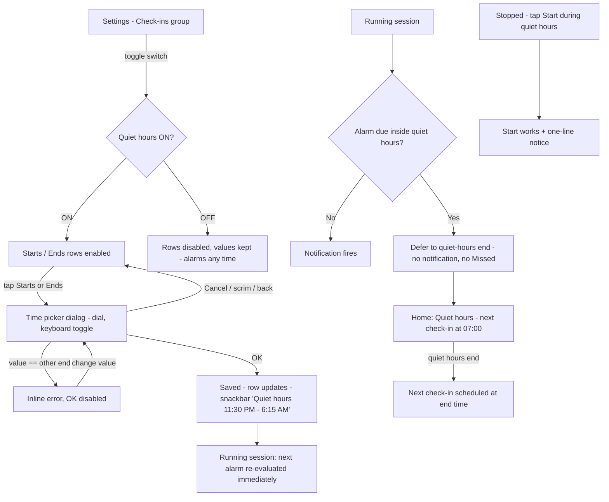

# US-10 — Quiet hours

Story: `docs/product/user-stories.md#us-10` · Tokens: `design-system.md` · Status: Ready for Eng (revised 2026-10-01 — §2 rewritten for time pickers)

## 1. Flow



## 2. Settings — Check-ins group *(rewritten 2026-10-01: Starts/Ends + time picker replace presets)*
The Check-ins group also hosts **Alert style** (US-11) above Quiet hours.
```
│ Check-ins                                        │  group header titleSmall primary
│ ┌──────────────────────────────────────────────┐ │  Card surfaceContainer, large
│ │ (Alert style rows — see US-11 §2)            │ │
│ │ ──────────────────────────────────────────── │ │  outlineVariant 1dp, inset 16dp
│ │ (bedtime) Quiet hours                  [●  ] │ │  ListItem 72dp, trailing Switch (whole row toggles)
│ │           No check-ins while you rest.       │ │  supporting
│ │                                              │ │
│ │           Starts                   10:00 PM  │ │  ListItem 56dp, indented 56dp; headline bodyLarge,
│ │           Ends                      7:00 AM  │ │  trailing time titleMedium primary tabular
│ │                                 Next day     │ │  Ends supporting (bodySmall onSurfaceVariant) only when end ≤ start
│ │           9 h of quiet                       │ │  bodySmall onSurfaceVariant, indented, 8dp below
│ └──────────────────────────────────────────────┘ │
```
- Default ON, **22:00–07:00**. Rows show times in the device 12/24 h format (`DateFormat.is24HourFormat`): "10:00 PM" / "22:00".
- **"Next day"** caption under the Ends time when the window crosses midnight (end < start). Removes any doubt that 23:30 → 06:15 means overnight. Same-day windows (13:00 → 14:00) show no caption.
- **Duration line** "9 h of quiet" / "1 h 30 min of quiet" (computed, wraps midnight). Cheap reassurance that the range is what the user meant.
- Switch OFF: Starts/Ends rows + duration stay visible at 38% alpha, not clickable (`enabled = false`), values kept.
- Whole rows are tappable (48dp+). Trailing time is part of the row's click target.

### 2.1 Time picker dialog
M3 `TimePicker` inside a `TimePickerDialog`-style `AlertDialog` (Compose `androidx.compose.material3.TimePicker` / `TimeInput`), container `surfaceContainerHigh`, shape `extraLarge`.
```
┌────────────────────────────────────────┐
│ Quiet hours start                      │  labelMedium onSurfaceVariant (dialog title slot, M3 picker header)
│   ┌──────┐   ┌──────┐   ┌────┐         │
│   │  10  │ : │  00  │   │ AM │         │  TimePicker clock-face mode (default)
│   └──────┘   └──────┘   │ PM │         │  hour/minute selectors primaryContainer when active
│                         └────┘         │
│            ( clock dial )              │  dial: surfaceContainerHighest, selector primary
│                                        │
│ Start and end can't be the same        │  bodySmall error — only in error state (live region polite)
│ (⌨)                   Cancel     OK    │  IconButton toggle dial↔keyboard | TextButtons
└────────────────────────────────────────┘
```
- Title: "Quiet hours start" / "Quiet hours end".
- Opens pre-set to the current value; `is24Hour` from the device setting. Any minute selectable (no 5-min snapping).
- **Mode toggle** bottom-left: `IconButton` `ic_keyboard` (switch to `TimeInput`) ↔ `ic_schedule` (back to dial). contentDescription "Switch to text input" / "Switch to clock".
- **Validation:** if the picked time equals the other end's time (to the minute), show the error line and disable **OK** (38%). Clears as soon as the value differs. No other limits (23 h 59 min allowed).
- **OK** saves → row updates → snackbar "Quiet hours 11:30 PM – 6:15 AM" (times per device format, en dash with spaces). **Cancel**, back or scrim → no change.
- Landscape / large font: M3 picker handles its own layout (`TimePickerLayoutType`); dialog scrolls if needed.

### 2.2 Snackbars
| Event | Text |
|-------|------|
| OK in picker | Quiet hours %1$s – %2$s |
| Switch on / off | Quiet hours on / Quiet hours off |

### 2.3 Range edit while running (AC7)
No extra UI. Home's session card updates immediately (enters/leaves the §3.1 quiet state; countdown recomputed). The snackbar from §2.2 is the only feedback.

## 3. Home during quiet hours
### 3.1 Session card (running, inside quiet hours with deferred alarm)
```
┌─────────────────────────────────────────────┐
│ (● Running) (bedtime Quiet hours)           │  StatusChip running + StatusChip quiet
│ QUIET HOURS                                 │  labelMedium onSurfaceVariant
│ Next check-in at 07:00                      │  titleLarge onSurface (tabular)
│ Rest easy — no check-ins until then.        │  bodyMedium onSurfaceVariant
│ [ ❚❚ Pause ]        [ ■ Stop ]              │
└─────────────────────────────────────────────┘
```
AC literal: **"Quiet hours — next check-in at 07:00"** = merged a11y label; the visible text shows overline "QUIET HOURS" + "Next check-in at 07:00". (If PM wants the literal on one line, use `titleMedium` "Quiet hours — next check-in at 07:00" — Designer prefers the two-line version.)
- The countdown is replaced by the absolute time (a 9-hour countdown is not useful at night).
- Greeting subtitle: "Quiet hours — rest easy." (US-01 table).
- Show this state as soon as "now" is inside quiet hours and the session is running (not only after an alarm was deferred), since any alarm due inside the window is deferred to its end anyway.

### 3.2 Start during quiet hours (stopped)
Start works. Session card shows the quiet-hours running state above, plus a one-shot snackbar: "Started. First check-in at 07:00, after quiet hours."

### 3.3 Stopped during quiet hours
No quiet-hours UI (irrelevant).

## 4. Debug (US-02)
"Simulate quiet hours now: ON" makes the app treat now as inside the configured window; readout shows "sim: ON". Home shows §3.1 with the configured end time (07:00 by default). The three preset buttons in the QA panel (22–07 / 23–08 / 21–06) stay as **QA shortcuts** (they set Starts/Ends directly; snackbar per §2.2) — QA can still test arbitrary ranges through the real pickers.

## 5. Copy (exact)
| Key | Text |
|-----|------|
| quiet_title | Quiet hours |
| quiet_support | No check-ins while you rest. |
| quiet_starts | Starts |
| quiet_ends | Ends |
| quiet_next_day | Next day |
| quiet_duration | %1$s of quiet |
| quiet_picker_title_start | Quiet hours start |
| quiet_picker_title_end | Quiet hours end |
| quiet_picker_error_same | Start and end can't be the same |
| quiet_picker_ok / cancel | OK / Cancel |
| quiet_picker_to_input_cd / to_dial_cd | Switch to text input / Switch to clock |
| quiet_chip | Quiet hours |
| quiet_overline | QUIET HOURS |
| quiet_next_at | Next check-in at %1$s |
| quiet_a11y | Quiet hours — next check-in at %1$s |
| quiet_body | Rest easy — no check-ins until then. |
| quiet_start_snackbar | Started. First check-in at %1$s, after quiet hours. |
| snackbar_quiet_range | Quiet hours %1$s – %2$s |
| snackbar_quiet_on / off | Quiet hours on / Quiet hours off |

## 6. Tokens
Quiet chip `tertiaryContainer`/`onTertiaryContainer` with `ic_bedtime` 16dp; settings card `surfaceContainer`; switch M3 default (`primary`); row times `titleMedium` `primary` + `tnum`; picker M3 defaults on `surfaceContainerHigh`, error `error`. New drawables: `ic_keyboard` (keyboard), `ic_schedule` (= existing `ic_missed`, schedule).

## 7. Motion
Entering/leaving quiet state on Home: content cross-fade `motion.medium`. Rows enable/disable: alpha `motion.short`. Picker: M3 dialog defaults; dial↔keyboard cross-fade `motion.short`.

## 8. Accessibility
- Switch row: "Quiet hours, No check-ins while you rest, switch, on".
- Starts/Ends rows: one merged node each, `Role.Button`, label spoken unambiguously in both formats, e.g. "Starts, 10:00 PM" / "Ends, 7:00 AM, next day"; onClick label "Change". Disabled state announced.
- Picker: M3 semantics; error line is a polite live region; OK announces disabled.
- Duration line merged into the Ends row's description is **not** needed — it stays a separate text node.
- Session card merged label per §3.1.

## 9. Test tags
`quiet_switch`, `quiet_starts`, `quiet_ends`, `quiet_duration`, `quiet_picker`, `quiet_picker_mode_toggle`, `quiet_picker_ok`, `quiet_picker_cancel`, `quiet_picker_error`, `quiet_state`, `quiet_next_at`, `qa_sim_quiet`, `qa_quiet_preset_22|23|21`.

## 10. Open questions
- *(Closed by QA 2026-10-01: §3 Home states, deferral, Start notice and Simulate all passed in the preset version — `docs/qa/US-10/report.md`; regression only.)*
- **Eng:** `TimePicker` in Compose M3 has no built-in dialog in older BOMs — wrap in `AlertDialog`/`BasicAlertDialog` with the layout in §2.1; confirm the BOM version supports `TimeInput` + `TimePickerState(is24Hour)`.
- **PM:** Start during quiet hours — Designer implements the proposed one-line notice as a snackbar (non-blocking). Confirm.
- **PM:** show "Quiet hours" state immediately when now is inside the window (Designer proposal) vs only after an alarm is deferred.
- **Eng:** quiet windows crossing midnight — end time is next day; confirm DST handling (use `ZonedDateTime`).
