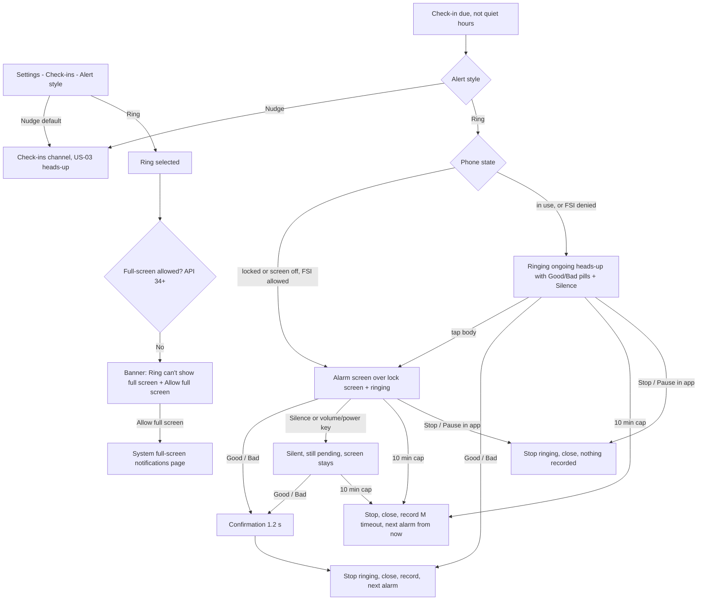

# US-11 — Alert style: Nudge vs Ring

Story: `docs/product/user-stories.md#us-11` · Tokens: `design-system.md` · Status: Ready for Eng · Written 2026-10-01

**Intent:** Ring is an *opt-in, real alarm*. It must be **unmissable but not alarming**: a calm screen with one obvious question and two huge, unmistakable answers. No red chrome, no flashing, no countdowns. The only red on the screen is the Bad button. Nudge (the default) is unchanged: US-03 heads-up with the Option B pills.

## 1. Flow



## 2. Settings — Alert style (Check-ins group, above Quiet hours)

```
│ Check-ins                                          │  group header titleSmall primary
│ ┌────────────────────────────────────────────────┐ │  Card surfaceContainer, large
│ │ Alert style                                    │ │  ListItem headline bodyLarge (no icon), 48dp
│ │ How check-ins get your attention.              │ │  supporting bodyMedium onSurfaceVariant
│ │                                                │ │
│ │ ┌────────────────────────────────────────────┐ │ │  Option tile 1 (selected): shape medium,
│ │ │ (bell)  Nudge                          (•) │ │ │  container secondaryContainer, 1dp primary border
│ │ │         One sound and buzz                 │ │ │  headline titleMedium, supporting bodyMedium
│ │ └────────────────────────────────────────────┘ │ │  min 72dp, whole tile = RadioButton role
│ │ ┌────────────────────────────────────────────┐ │ │  Option tile 2 (unselected): surfaceContainerHigh,
│ │ │ (alarm) Ring                           ( ) │ │ │  no border
│ │ │         Rings like an alarm until you      │ │ │
│ │ │         answer                             │ │ │
│ │ └────────────────────────────────────────────┘ │ │  8dp between tiles
│ │ (Ring-only note + banners, §2.1)               │ │
│ │ ────────────────────────────────────────────── │ │
│ │ (Quiet hours — US-10 §2)                       │ │
│ └────────────────────────────────────────────────┘ │
```
- Two **selectable tiles** (not a plain radio list): the choice changes how the phone behaves at 3 a.m., so it deserves more than a radio row. `Modifier.selectable(role = Role.RadioButton)` + `selectableGroup()`. Leading icons: `ic_notifications` (Nudge), `ic_alarm` (Ring), 24dp `onSurfaceVariant` (selected tile: `onSecondaryContainer`). Trailing `RadioButton`.
- Selecting saves immediately. Snackbar: "Alert style: Ring" / "Alert style: Nudge". Applies to the **next** check-in (AC12). No confirmation dialog.

### 2.1 Ring-only content (shown under the tiles when Ring is selected, `AnimatedVisibility` expand `motion.medium`)
1. **Note** (always, Ring selected): bodySmall `onSurfaceVariant`, with `ic_info` 16dp:
   "Rings even on silent, at your alarm volume. Stops by itself after 10 min."
2. **Full-screen banner** (API 34+, `canUseFullScreenIntent() == false`): `InfoBanner(attention)`, icon `ic_fullscreen`, title "Ring can't show full screen", body "It will ring as a notification instead. Allow full screen to see check-ins on your lock screen.", action **Allow full screen** → `Settings.ACTION_MANAGE_APP_USE_FULL_SCREEN_INTENT` (`package:` URI). Re-checked on `ON_RESUME`.
3. **Exact-timing banner** (exact alarms denied): the US-05 banner, same copy and actions (AC10).
Banners inside the card use `InfoBanner` with 0dp outer margin, 12dp gap.

## 3. Alarm screen (full-screen activity, `AlarmActivity`)

Shown over the lock screen (`setShowWhenLocked(true)`, `setTurnScreenOn(true)`), no keyguard dismissal needed to answer. Edge-to-edge, follows the app's **resolved theme** (light or dark; the user's Theme setting, default System). Portrait-first; landscape §3.6.

### 3.1 Layout (compact, 412×915dp reference)
```
┌──────────────────────────────────────────────┐
│ (☺) SuperUnclench · Check-in                 │  labelLarge onSurfaceVariant, top 24dp below status bar, centred
│                                              │
│                  9:41                        │  displayLarge (57sp) tabular onSurface — current time, ticks per minute
│              Thu, Oct 1                      │  bodyLarge onSurfaceVariant
│                                              │  16dp
│          ( Level 3 · Aware )                 │  Surface pill shape full, surfaceContainerHigh, labelLarge onSurfaceVariant, 32dp
│                                              │
│               .-""""-.                       │  Breathing circle §3.3: 168dp primaryContainer disc,
│              /        \                      │  sentiment_calm 72dp primary in centre
│             |  (-‿-)   |                     │
│              \        /                      │
│               '-....-'                       │  24dp
│                                              │
│          Is your jaw relaxed?                │  headlineMedium onSurface, centred
│        Notice it, then tap one.              │  bodyLarge onSurfaceVariant, centred
│                                              │  flexible space (weight) — buttons sit in the thumb zone
│ ┌───────────────────┐ ┌───────────────────┐  │  AnswerTiles §3.2: 2 equal, gap 12dp,
│ │        ✓          │ │        ✕          │  │  height 128dp, shape extraLarge (28dp)
│ │       Good        │ │       Bad         │  │
│ │  I was relaxed    │ │  I was clenching  │  │
│ └───────────────────┘ └───────────────────┘  │  16dp
│        (🔇) Silence                          │  TextButton 48dp, onSurfaceVariant, centred
│                                              │  + navigation bar inset + 16dp
└──────────────────────────────────────────────┘
```
- Background: `surface`, plus a soft **radial glow** of `primaryContainer` at 55% alpha centred behind the breathing circle, radius ≈ 70% of screen width, fading to transparent. No other gradients. (Dark: `primaryContainer` #244776 glow on #111318 reads as a calm night-blue halo; light: #D5E3FF on #F9F9FF.)
- Gutter 24dp. Content max width 480dp, centred (tablets/foldables).

### 3.2 Answer tiles (`AlarmAnswerTile`, new component)
| Property | Good | Bad |
|----------|------|-----|
| Container | `good` | `bad` |
| Content | `onGood` | `onBad` |
| Icon | `ic_good` 36dp | `ic_bad` 36dp |
| Label | "Good" `headlineSmall` weight 500 | "Bad" |
| Caption | "I was relaxed" `bodyMedium` (content at 85%) | "I was clenching" |
| Size | ≥ 128dp tall, half width (≥ 160dp) — well above the 96dp minimum | same |
| Shape | `extraLarge` 28dp (a big rounded rect, not a pill — reads as a target, not a toggle) | same |
- Order: Good **left**, Bad **right** (same as everywhere; mirrors in RTL).
- Pressed: M3 state layer + scale 0.97 (`motion.short`). Haptic `HapticFeedbackConstants.CONFIRM` on accept.
- Contrast per design-system §2.5 (≥ 6.3:1 both themes).
- **Pocket / accidental-touch guard** (founder requirement "no accidental answers from a pocket swipe"):
  1. Tiles ignore input for the first **800 ms** after the screen becomes visible (they fade in from 0% → 100% over that time, so the guard is visible, not mysterious).
  2. A tap counts only on **release inside the same tile** with a single pointer; if a second pointer touches down (palm, fabric) the gesture is cancelled.
  3. A drag that travels > 24dp cancels (swipes across the screen don't answer).
  4. `filterTouchesWhenObscured = true`.
  - TalkBack users: accessibility click bypasses rule 1-3 (they're explicit actions).
  - No long-press / slide-to-answer: one tap stays the core promise ("answer with one tap"), and slides are hard for motor-impaired users.

### 3.3 Breathing circle (the "calm" in calm-but-clear)
- 168dp disc `primaryContainer`, centre icon `sentiment_calm` 72dp `primary` (`onPrimaryContainer` in dark for contrast).
- Animation: scale 0.92 ↔ 1.00, **4 s in / 4 s out**, `FastOutSlowInEasing`, infinite — a slow breathing cue that invites the user to relax the jaw. Glow alpha follows (45% ↔ 60%).
- While **silenced**, keep breathing (it's calming, not alerting).
- Reduced motion (`ANIMATOR_DURATION_SCALE == 0`): static at scale 1.0.
- Purely decorative: `contentDescription = null`, `clearAndSetSemantics {}`.

### 3.4 States
| State | Presentation |
|-------|--------------|
| Ringing | As §3.1. Sound + vibration. |
| Silenced (Silence button, volume or power key) | Sound/vibration stop. Silence button becomes disabled text "Silenced" with `ic_volume_off`. A line appears under it: "Still waiting for your answer." bodySmall `onSurfaceVariant`. Screen stays (after power key the screen turns off; next power press shows it again over the lock screen). |
| Answered | Tiles + question cross-fade (`motion.medium`) to a centred confirmation panel: 96dp circle `goodContainer`/`badContainer` with `ic_good`/`ic_bad` 48dp, then `headlineSmall` "Nice — noted." / "Noted. Unclench and breathe out." If the level changed, a second line `bodyLarge`: "Level up! Check-ins now every 10 min." / "Back to Level 2 — check-ins every 10 min." (US-04 copy). Holds **1.2 s** (2.0 s if a level line shows), then `finish()`. |
| Timed out (10 min cap) | No UI: screen closes silently, notification removed, `M timeout` recorded. (A screen saying "you missed it" at 3 a.m. would be guilt; US-07 tone.) |
| Stop / Pause from app | Screen closes immediately, nothing recorded. |
| Opened after it stopped (stale intent) | Activity finishes immediately (never shows answer buttons for a resolved check-in). |

### 3.5 Copy on the alarm screen
Kind, non-medical. The question is phrased so **Good = yes** ("Is your jaw relaxed?" → Good "I was relaxed"); notification title "Check-in: jaw relaxed?" matches.

### 3.6 Landscape / large font
- Landscape (or height < 600dp): two columns — left: time, date, level pill, question (breathing circle hidden); right: tiles stacked vertically (Good above Bad), each ≥ 96dp tall, Silence below.
- fontScale ≥ 1.5 or tile width < 160dp: tiles stack vertically, full width, Good on top, each ≥ 112dp. Time drops to `displayMedium`. Content scrolls if needed; tiles stay within the bottom 60% of the screen.

## 4. Ringing heads-up (phone in use, or full-screen denied)
Same `DecoratedCustomViewStyle` layout as the Option B pills (US-03 sign-off), on the **"Check-in alarms"** channel, `CATEGORY_ALARM`, `setOngoing(true)`, `FLAG_INSISTENT` sound, full-screen intent → `AlarmActivity` (when allowed).
```
┌──────────────────────────────────────────────────┐
│ (☺) SuperUnclench · now · (alarm) Ringing        │  header; sub-text "Ringing" (short, no truncation risk)
│ Check-in: jaw relaxed?                           │  title
│ [ ✓ Good ]  [ ✕ Bad ]                 Silence    │  pills 40dp (notif_good / notif_bad) + text button 48dp
└──────────────────────────────────────────────────┘
```
- **Silence** in the custom view: `TextView` button, `TextAppearance.Compat.Notification`, `setOnClickPendingIntent` → silences (sound + vibration off), notification stays, re-posted with `setOnlyAlertOnce(true)` and sub-text "Silenced".
- Body tap → opens `AlarmActivity` (even when unlocked) — the large-target screen.
- Collapsed (shade): title + "Ringing — tap to answer" (pills in expanded/heads-up only, as Option B).
- No swipe-dismiss (ongoing). Not cleared by "Clear all".
- In the **status bar**, `ic_stat_checkin` as usual.

## 5. In-app while ringing
- **Home pending card** (US-03 §2.2): overline becomes `(alarm) RINGING · 9:41 AM` (`ic_alarm` 16dp, labelMedium `onPrimaryContainer`), and a **Silence** `TextButton` (`ic_volume_off`) appears right-aligned under the captions. After silencing, overline returns to `CHECK-IN · 9:41 AM` + hint "Silenced — still waiting for your answer." (bodySmall, 70%). Good/Bad on the card stop the ring (AC5, source `card`).
- Opening the app does **not** stop ringing (AC: only answer, Stop/Pause, cap).
- Session card: unchanged (status Running; countdown hidden while ringing → shows "Ringing now" in place of "in mm:ss", `titleLarge` `primary`; a11y "Check-in ringing now").
- **Home banner** for full-screen denied (Ring selected): slot A, priority **2** (after notifications-off, before exact-timing), same copy as §2.1.2.

## 6. Sound & vibration
- **Sound:** the device's **default alarm sound** (`RingtoneManager.TYPE_ALARM`) on the alarm stream — users already chose it and it's guaranteed loopable. **Gentle start:** volume ramps from 25% → 100% of the alarm volume over the first **20 s** (crescendo), then holds. (Requires the player route rather than channel sound; Eng to confirm — if the channel route is chosen, no ramp, accept.) Custom bundled tone is a v1.x option (open question).
- **Vibration:** repeating `[0, 600, 800]` (soft long pulses, ~1.4 s cycle) — distinct from Nudge's two short pulses.
- Silence/answer/cap/Stop stop both within 1 s.

## 7. Copy (exact)
| Key | Text |
|-----|------|
| settings_alert_style | Alert style |
| settings_alert_style_support | How check-ins get your attention. |
| alert_nudge | Nudge |
| alert_nudge_desc | One sound and buzz |
| alert_ring | Ring |
| alert_ring_desc | Rings like an alarm until you answer |
| alert_ring_note | Rings even on silent, at your alarm volume. Stops by itself after 10 min. |
| snackbar_alert_style | Alert style: %1$s |
| banner_fsi_title | Ring can't show full screen |
| banner_fsi_body | It will ring as a notification instead. Allow full screen to see check-ins on your lock screen. |
| banner_fsi_action | Allow full screen |
| ring_channel_name | Check-in alarms |
| ring_channel_desc | Check-ins that ring until you answer (Ring alert style). |
| alarm_header | SuperUnclench · Check-in |
| alarm_level | Level %1$d · %2$s |
| alarm_question | Is your jaw relaxed? |
| alarm_body | Notice it, then tap one. |
| alarm_good / alarm_good_caption | Good / I was relaxed |
| alarm_bad / alarm_bad_caption | Bad / I was clenching |
| alarm_silence | Silence |
| alarm_silenced | Silenced |
| alarm_still_waiting | Still waiting for your answer. |
| alarm_answered_good / bad | Nice — noted. / Noted. Unclench and breathe out. |
| ring_notif_subtext | Ringing |
| ring_notif_subtext_silenced | Silenced |
| ring_notif_collapsed_text | Ringing — tap to answer |
| pending_overline_ringing | RINGING · %1$s |
| pending_silenced_hint | Silenced — still waiting for your answer. |
| session_ringing_now | Ringing now |

## 8. Tokens
- Alarm screen: background `surface` + radial `primaryContainer` 55%; text `onSurface`/`onSurfaceVariant`; level pill `surfaceContainerHigh`; breathing disc `primaryContainer`, icon `primary` (light) / `onPrimaryContainer` (dark); tiles `good`/`onGood`, `bad`/`onBad`, shape `extraLarge`; confirmation circle `goodContainer`/`badContainer`.
- Settings tiles: selected `secondaryContainer` + 1dp `primary` border; unselected `surfaceContainerHigh`; shape `medium`.
- Banners: `InfoBanner(attention)`.
- New drawables (Material Symbols Rounded, w400, fill 0): `ic_alarm` (exists), `ic_fullscreen` (fullscreen), `ic_volume_off` (volume_off).
- New component: `AlarmAnswerTile` (design-system §9.7 — add).

## 9. Motion
- Alarm screen enter: content fades in 300ms (`motion.medium`); tiles fade in over the 800ms guard window.
- Breathing: 8 s cycle (§3.3). Time text: no animation.
- Answer → confirmation cross-fade `motion.medium`; finish with the default activity exit.
- Reduced motion: no breathing, instant cross-fades; guard window still 800ms (tiles appear at 800ms without fade).

## 10. Accessibility
- On show, TalkBack announces (window title / `paneTitle`): "Check-in alarm. Is your jaw relaxed?" Focus order: question → Good → Bad → Silence → time/level.
- Tiles: `Role.Button`, labels "Good, I was relaxed" / "Bad, I was clenching". Silence: "Silence alarm"; after: "Silenced".
- Time: "9:41 AM, Thursday, October 1".
- Colour never alone: icons + words on tiles.
- Contrast: all pairs from design-system §2.5; level pill `onSurfaceVariant` on `surfaceContainerHigh` ≥ 7:1.
- Large font: §3.6.
- Settings tiles: "Nudge, One sound and buzz, radio button, selected, 1 of 2".

## 11. Debug (QA panel, Session & alarms section — US-02)
| Button | Effect | Snackbar | Tag |
|--------|--------|----------|-----|
| Alert style: Nudge/Ring | toggles the setting | Alert style: Ring | `qa_alert_style` |
| Short ring cap: OFF/ON | cap 10 min ↔ 15 s | Short ring cap ON (15 s) | `qa_short_ring_cap` |
| Preview: full-screen denied: OFF/ON | forces `canUseFullScreenIntent() == false` for UI + fallback path | Preview full-screen denied ON | `qa_preview_fsi_denied` |
| Preview alarm screen | opens `AlarmActivity` in preview mode (no sound, no record; answering shows the confirmation then closes; readout unchanged) — for light/dark screenshots | Alarm screen preview | `qa_preview_alarm_screen` |
| Silence ring | same as Silence | Silenced / Not ringing | `qa_silence_ring` |
- Readout row: `Alert  Ring · FSI granted · ringing yes (cap 10:52:07)` (tag `qa_state_alert`); jump chip unchanged (lives in Session).

## 12. Test tags
`settings_alert_nudge`, `settings_alert_ring`, `alert_ring_note`, `banner_fsi`, `banner_fsi_allow`, `alarm_screen`, `alarm_time`, `alarm_level`, `alarm_question`, `alarm_good`, `alarm_bad`, `alarm_silence`, `alarm_confirmation`, `pending_ringing_overline`, `pending_silence`, plus §11 tags.

## 13. Open questions
- **Eng:** player route (FGS `mediaPlayback`/`shortService` with ramp) vs channel sound + `FLAG_INSISTENT` (no ramp). Designer prefers the ramp; accept channel route if FGS risk on API 34+ is high.
- **Eng:** pocket guard — is a proximity-sensor check (ignore taps while covered) cheap? Nice-to-have on top of §3.2.
- **PM:** bundled custom tone (soft marimba loop) vs device default alarm sound — Designer recommends **device default** for v1.
- **PM:** a "Test ring" button under the Ring tile (plays 3 s, no record) would build trust before the first 3 a.m. surprise — Designer recommends it as a **Could**.
